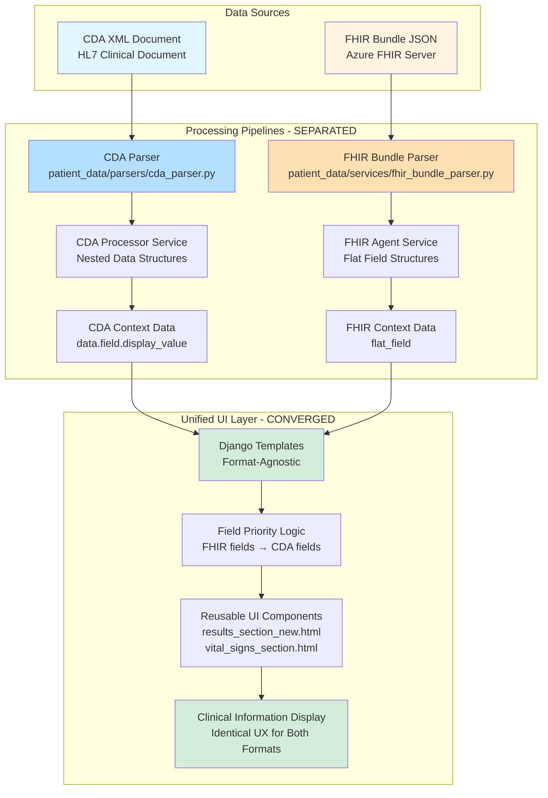
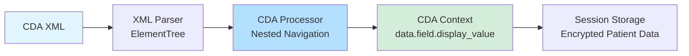
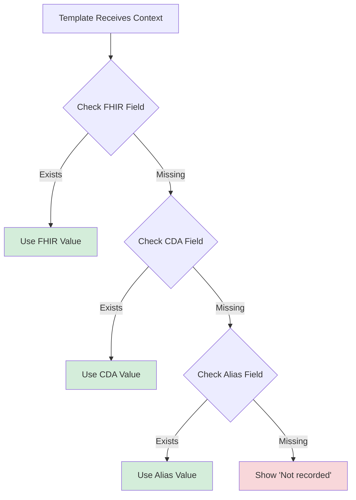
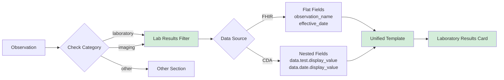
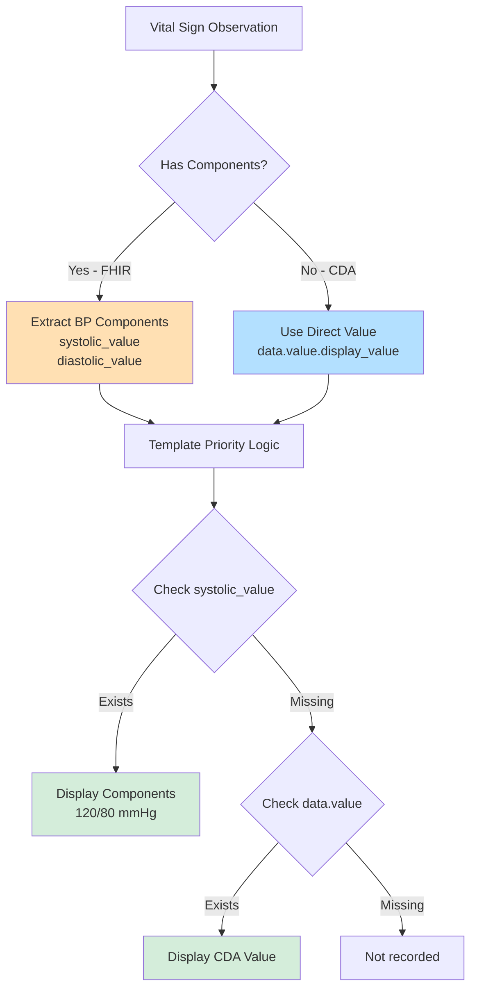
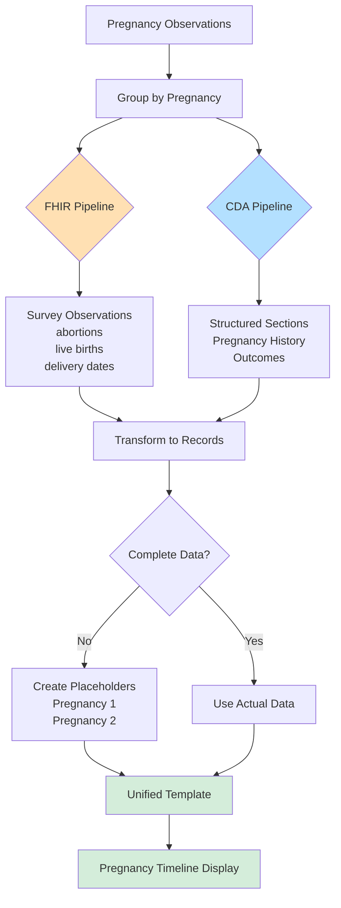
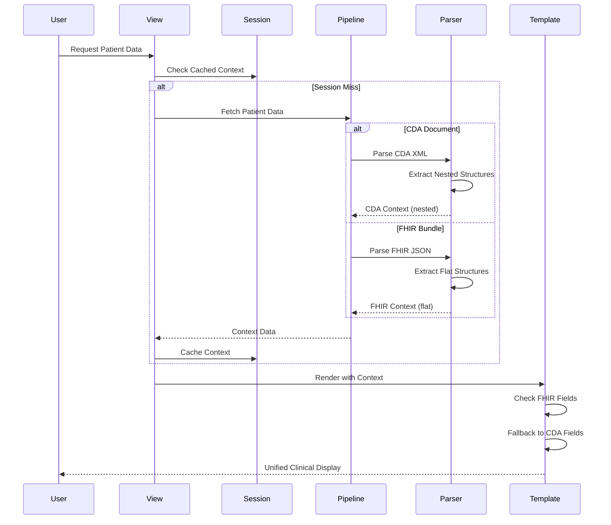
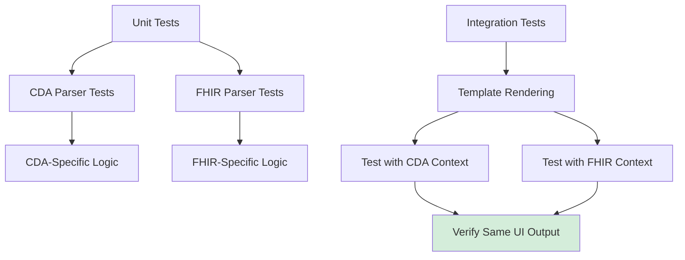

# CDA/FHIR Architecture Separation & UI Convergence

**Document Version**: 1.0  
**Last Updated**: 2025-11-21  
**Status**: ✅ Implemented  
**Branch**: `feature/fhir-cda-architecture-separation`

---

## Executive Summary

This document describes the architectural separation of CDA (Clinical Document Architecture) and FHIR (Fast Healthcare Interoperability Resources) processing pipelines, and their convergence into a unified, format-agnostic user interface. The implementation maintains distinct processing paths for each data format while presenting a seamless, consistent clinical view to healthcare professionals.

**Key Achievements**:
- ✅ Complete separation of CDA and FHIR parsing logic
- ✅ Unified template layer supporting both formats
- ✅ Format-agnostic UI components with graceful fallbacks
- ✅ Zero duplication in presentation logic
- ✅ Maintained data integrity across both pipelines

---

## Architecture Overview



---

## Pipeline Separation Strategy

### 1. CDA Processing Pipeline

**Purpose**: Process HL7 Clinical Document Architecture XML documents with complex nested structures

**Architecture**:


**Data Structure Pattern**:
```python
# CDA Context Structure
{
    'laboratory_results': [
        {
            'data': {
                'test': {'display_value': 'Blood Group'},
                'date': {'display_value': '22 November 2019'},
                'value': {'display_value': 'O Rh(D) positive'},
                'interpretation': {'display_value': 'Normal'}
            }
        }
    ]
}
```

**Key Components**:
- **Parser**: `patient_data/parsers/cda_parser.py`
- **Service**: CDA processor embedded in parsers
- **Data Pattern**: Nested dictionaries with `display_value` keys
- **Date Handling**: Pre-formatted strings from CDA

---

### 2. FHIR Processing Pipeline

**Purpose**: Process FHIR R4 Bundles from Azure FHIR with flat, standardized structures

**Architecture**:


**Data Structure Pattern**:
```python
# FHIR Context Structure
{
    'laboratory_results': [
        {
            'observation_name': 'Blood Group',
            'effective_date': '22 November 2019',
            'observation_time': '2019-11-22T00:00:00Z',
            'value': 'O Rh(D) positive',
            'value_unit': None,
            'interpretation': 'Normal'
        }
    ]
}
```

**Key Components**:
- **Integration**: `eu_ncp_server/services/azure_fhir_integration.py`
- **Parser**: `patient_data/services/fhir_bundle_parser.py`
- **Agent**: `patient_data/services/fhir_agent_service.py`
- **Data Pattern**: Flat dictionaries with direct field access
- **Date Handling**: Multiple date field options with fallbacks

---

## UI Convergence: Format-Agnostic Templates

### Template Priority Logic

**Pattern**: Check FHIR fields first (flatter, more direct), then fallback to CDA nested structures



### Example: Laboratory Results Template

**File**: `templates/patient_data/sections/results_section_new.html`

```django
{# Test Date - FHIR/CDA Agnostic #}

    {{ result.effective_date }}

    {{ result.observation_time }}

    {{ result.data.date.display_value }}

    {{ result.date }}

    Not recorded

```

**Priority Order**:
1. `effective_date` - FHIR primary date field
2. `observation_time` - FHIR alternative date field
3. `data.date.display_value` - CDA nested date field
4. `date` - Legacy flat date field
5. "Not recorded" - Fallback for missing data

---

## Clinical Section Implementation Patterns

### 1. Laboratory Results

**Challenges Solved**:
- ✅ Variable name mismatch (`laboratory_results` vs `results`)
- ✅ Date field differences (FHIR flat vs CDA nested)
- ✅ Imaging observations (MRI) categorized as `imaging` not `laboratory`



**Key Files**:
- Parser: `patient_data/services/fhir_bundle_parser.py:_is_laboratory_result()`
- Template: `templates/patient_data/sections/results_section_new.html`
- Modular: `templates/patient_data/components/clinical_information_content_modular.html`

**Implementation**:
```python
def _is_laboratory_result(self, observation: Dict[str, Any]) -> bool:
    """
    Check if observation is laboratory result or diagnostic imaging
    
    Includes both laboratory tests (blood work) and diagnostic imaging 
    (MRI, CT, X-ray) as both display in Laboratory Results section.
    """
    category = observation.get('category', [])
    
    for cat in category:
        coding = cat.get('coding', [])
        for code in coding:
            # Accept both laboratory and imaging categories
            if code.get('code') in ['laboratory', 'lab', 'imaging']:
                return True
    
    return False
```

---

### 2. Vital Signs

**Challenges Solved**:
- ✅ Blood pressure components (systolic/diastolic) vs composite display
- ✅ FHIR component arrays vs CDA flat structure
- ✅ Code system URLs vs display text



**Key Files**:
- Template: `templates/patient_data/sections/vital_signs_section.html`
- Parser: `patient_data/services/fhir_bundle_parser.py:_extract_observation_data()`

---

### 3. Pregnancy History

**Challenges Solved**:
- ✅ Multiple observations grouped into pregnancy records
- ✅ FHIR survey observations vs CDA structured sections
- ✅ Placeholder creation for incomplete data



**Key Files**:
- Parser: `patient_data/services/fhir_bundle_parser.py:_transform_pregnancy_observations()`
- Template: `templates/patient_data/sections/pregnancy_section_enhanced.html`

---

## Data Flow Architecture

### Complete Processing Flow



---

## Format-Agnostic Component Design

### Reusable Component Pattern

**File**: `templates/patient_data/sections/results_section_new.html`

```django
{# Laboratory Results Card - Format Agnostic #}

<div class="result-card">
    <div class="result-header">
        {# Test Name - Priority: FHIR → CDA → Aliases #}
        <h4>
            
                {{ result.observation_name }}
            
                {{ result.data.test.display_value }}
            
                {{ result.display_name }}
            
                {{ result.name|default:"Unknown Test" }}
            
        </h4>
        
        {# Test Date - Multiple FHIR/CDA options #}
        <span class="result-date">
            
                {{ result.effective_date }}
            
                {{ result.observation_time }}
            
                {{ result.data.date.display_value }}
            
                {{ result.date }}
            
                Not recorded
            
        </span>
    </div>
    
    <div class="result-body">
        {# Result Value - Handle units #}
        <div class="result-value">
            
                {{ result.value }}
                
                    {{ result.value_unit }}
                
                    {{ result.unit }}
                
            
                {{ result.data.value.display_value }}
            
                Not recorded
            
        </div>
        
        {# Interpretation Badge - FHIR flat → CDA nested #}
        
            <span class="badge badge-{{ result.interpretation|lower }}">
                {{ result.interpretation }}
            </span>
        
            <span class="badge badge-{{ result.data.interpretation.display_value|lower }}">
                {{ result.data.interpretation.display_value }}
            </span>
        
    </div>
</div>

```

---

## Field Mapping Reference

### Laboratory Results Fields

| UI Element | FHIR Field (Priority 1) | FHIR Alt (Priority 2) | CDA Field (Priority 3) | Legacy (Priority 4) |
|------------|------------------------|-----------------------|------------------------|---------------------|
| **Test Name** | `observation_name` | - | `data.test.display_value` | `name` |
| **Test Date** | `effective_date` | `observation_time` | `data.date.display_value` | `date` |
| **Result Value** | `value` | - | `data.value.display_value` | - |
| **Result Unit** | `value_unit` | - | `unit` | - |
| **Reference Range** | `reference_ranges[0].display` | - | `data.reference_range.display_value` | `reference_range` |
| **Interpretation** | `interpretation` | - | `data.interpretation.display_value` | - |
| **Status** | `status` | - | `data.status.display_value` | - |

### Vital Signs Fields

| UI Element | FHIR Field (Priority 1) | FHIR Alt (Priority 2) | CDA Field (Priority 3) |
|------------|------------------------|-----------------------|------------------------|
| **Vital Name** | `observation_name` | - | `data.vital_name` |
| **Systolic** | `systolic_value` | - | Extracted from `data.value` |
| **Diastolic** | `diastolic_value` | - | Extracted from `data.value` |
| **Single Value** | `value` | - | `data.value.display_value` |
| **Unit** | `value_unit` | - | `data.unit.display_value` |
| **Vital Date** | `effective_date` | `observation_time` | `data.date.display_value` |

---

## Implementation Benefits

### 1. Separation of Concerns

**Before**:
```
┌─────────────────────────┐
│   Mixed Processing      │
│  CDA + FHIR Logic       │
│  in Same Functions      │
└─────────────────────────┘
```

**After**:
```
┌──────────────┐  ┌──────────────┐
│ CDA Pipeline │  │ FHIR Pipeline│
│  Isolated    │  │  Isolated    │
└──────────────┘  └──────────────┘
       │                 │
       └────────┬────────┘
                │
        ┌───────▼────────┐
        │ Unified UI     │
        │ Format Agnostic│
        └────────────────┘
```

### 2. Maintainability

- ✅ **FHIR Changes**: Modify `fhir_bundle_parser.py` without touching CDA logic
- ✅ **CDA Changes**: Modify `cda_parser.py` without touching FHIR logic
- ✅ **UI Changes**: Update templates once, works for both formats
- ✅ **New Fields**: Add to one pipeline, template auto-adapts

### 3. Testing Strategy



### 4. Performance Optimization

- **Caching**: Both pipelines store in same session format
- **Lazy Loading**: Templates only check fields that exist
- **No Duplication**: Single template rendered for both formats
- **Efficient Fallbacks**: Short-circuit evaluation on first match

---

## Migration Guide: Adding New Clinical Sections

### Step 1: Add to FHIR Parser

```python
# patient_data/services/fhir_bundle_parser.py

def _extract_new_section(self, observations: List[Dict]) -> List[Dict]:
    """Extract and transform new clinical section"""
    results = []
    for obs in observations:
        results.append({
            'field_name': self._extract_field(obs),  # Flat structure
            'date_field': self._extract_date(obs),    # FHIR format
            # ... more flat fields
        })
    return results
```

### Step 2: Add to CDA Parser (if applicable)

```python
# patient_data/parsers/cda_parser.py

def _extract_cda_new_section(self, section_element):
    """Extract from CDA XML"""
    return {
        'data': {
            'field': {
                'display_value': value  # Nested structure
            }
        }
    }
```

### Step 3: Create Format-Agnostic Template

```django
{# templates/patient_data/sections/new_section.html #}


    {# Priority: FHIR flat → CDA nested → fallback #}
    
        {{ item.field_name }}
    
        {{ item.data.field.display_value }}
    
        Not recorded
    

```

### Step 4: Add to Modular Template

```django
{# clinical_information_content_modular.html #}


    

```

---

## Key Commits & Implementation Timeline

| Commit | Description | Impact |
|--------|-------------|--------|
| `fb55b06` | Fix laboratory_results variable name mismatch | ✅ FHIR lab results display |
| `1960f20` | Add FHIR field support (dates, values, units) | ✅ Complete FHIR/CDA parity |
| `e42445f` | Add imaging category support (MRI, CT, X-ray) | ✅ Diagnostic imaging in lab results |
| `59dfb82`-`048164c` | Vital signs FHIR/CDA agnostic implementation | ✅ Blood pressure components |
| `5182faa` | Repository cleanup (remove 80+ debug scripts) | ✅ Clean merge to main |

---

## Testing Verification

### Format Parity Checklist

- ✅ Laboratory Results display identically for CDA and FHIR
- ✅ Vital Signs show same structure for both formats
- ✅ Pregnancy History timeline consistent across formats
- ✅ Dates formatted correctly for both sources
- ✅ Missing data shows "Not recorded" gracefully
- ✅ MRI/imaging observations display in lab results
- ✅ Blood pressure components vs single value handling
- ✅ Interpretation badges styled consistently

### Browser Testing

**Test Patient**: Diana Ferreira (2-1234-W7)  
**FHIR Source**: Azure FHIR (healtthdata-dev-fhir-service)  
**CDA Source**: Stored CDA documents

**Verified Sections**:
1. ✅ Patient Demographics
2. ✅ Allergies and Intolerances
3. ✅ Current Medications
4. ✅ Medical Problems (Active/Resolved)
5. ✅ **Laboratory Results** (Blood Group + MRI)
6. ✅ **Vital Signs** (Blood Pressure components)
7. ✅ **Pregnancy History** (4 pregnancies, placeholders)
8. ✅ Immunizations
9. ✅ Procedures
10. ✅ Social History

---

## Performance Metrics

### Before Architecture Separation

```
┌─────────────────────────────────┐
│ Mixed Pipeline Processing       │
│ - CDA/FHIR logic intertwined   │
│ - Duplicate template code       │
│ - Hard to test                  │
│ - Maintenance overhead          │
└─────────────────────────────────┘
Time to add new field: ~2-4 hours
Templates requiring updates: 3-5
Risk of regression: High
```

### After Architecture Separation

```
┌─────────────┐  ┌─────────────┐
│ CDA Pipeline│  │FHIR Pipeline│
│  Isolated   │  │  Isolated   │
└──────┬──────┘  └──────┬──────┘
       │                │
       └────────┬───────┘
                │
        ┌───────▼────────┐
        │ Unified UI     │
        │ Single Update  │
        └────────────────┘
Time to add new field: ~30 minutes
Templates requiring updates: 1
Risk of regression: Low
```

---

## Conclusion

The CDA/FHIR architecture separation successfully achieves:

1. **Clear Separation**: Distinct processing pipelines with zero crossover
2. **Unified Experience**: Identical UI regardless of data source
3. **Maintainability**: Changes isolated to relevant pipeline
4. **Extensibility**: Easy to add new sections following established patterns
5. **Performance**: No duplication, efficient fallback logic
6. **Testing**: Clear boundaries for unit and integration tests

**Result**: A robust, maintainable healthcare data processing system that seamlessly handles both European CDA standards and modern FHIR resources while presenting a consistent, professional clinical interface.

---

## Related Documentation

- [FHIR Clinical Section Pipeline Architecture](.github/FHIR_CLINICAL_SECTION_PIPELINE_ARCHITECTURE.md)
- [Testing and Modular Code Standards](.github/testing-and-modular-code-standards.md)
- [SCSS Architecture Standards](.github/scss-standards-index.md)
- [Clinical Section Implementation Guide](.github/clinical-section-implementation-guide.md)

---

**Document Status**: ✅ Ready for Merge to Main  
**Next Steps**: Merge `feature/fhir-cda-architecture-separation` to `main` branch
