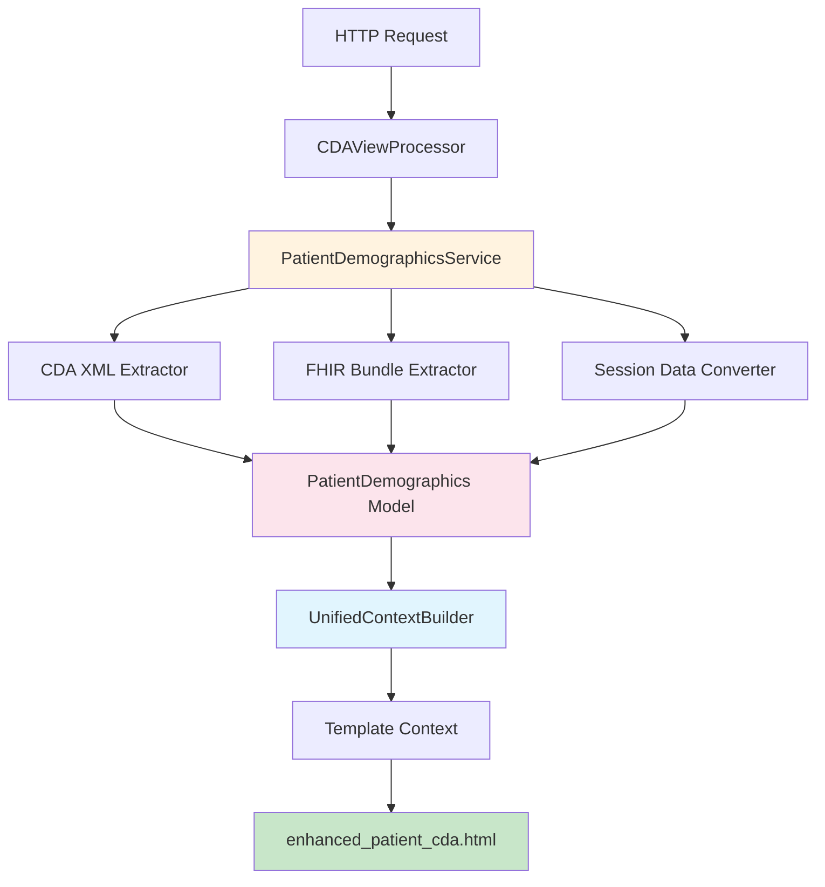

# Patient Demographics Service Architecture

## Django NCP Healthcare Portal - Unified Patient Processing

**Generated**: December 19, 2024  
**Based on**: L3 XML CDA Process Maps Analysis  
**Purpose**: Consolidate patient demographic extraction across FHIR and CDA sources

---

## 🎯 **Service Overview**

The `PatientDemographicsService` consolidates scattered patient data extraction logic into a unified, testable, and maintainable service. This implements the consolidation recommendations from the L3 XML CDA Process Maps analysis.

### **Current State Problems**

1. **Scattered Extraction Logic**
   - `_extract_patient_info()` in `EnhancedCDAXMLParser`
   - Similar logic in FHIR processors
   - No unified patient demographics service

2. **Multiple Template Context Aliases**
   - `patient_data`
   - `patient_information`
   - `patient_identity`
   - All contain identical data, causing template confusion

3. **Inconsistent Data Structures**
   - Different formats between FHIR and CDA paths
   - Manual date formatting in multiple locations
   - Identifier handling varies by source

---

## 🏗️ **Unified Architecture Design**

### **Service Layer Structure**



### **Data Model Structure**

```python
@dataclass
class PatientDemographics:
    """Unified patient demographics model"""
    given_name: str = "Unknown"
    family_name: str = "Unknown"
    birth_date: str = ""
    gender: str = "Unknown"
    patient_id: str = ""
    identifiers: List[PatientIdentifier] = field(default_factory=list)
    
    def get_display_name(self) -> str:
        """Diana Ferreira"""
        
    def get_formatted_birth_date(self) -> str:
        """08/05/1982"""
        
    def get_primary_identifier(self) -> PatientIdentifier:
        """2-1234-W7"""
```

---

## 🔄 **Implementation Strategy**

### **Phase 1: Service Creation**

#### **1.1 Create PatientDemographicsService**
```python
class PatientDemographicsService:
    """Unified service for patient demographic processing"""
    
    def extract_from_cda_xml(self, xml_root) -> PatientDemographics:
        """Consolidates EnhancedCDAXMLParser._extract_patient_info() logic"""
        
    def extract_from_fhir_bundle(self, fhir_bundle) -> PatientDemographics:
        """Standardized FHIR patient extraction"""
        
    def extract_from_session_data(self, session_data) -> PatientDemographics:
        """Convert existing session format to unified model"""
        
    def create_template_context(self, demographics) -> Dict:
        """Single method to create template context"""
```

#### **1.2 Create Unified Data Models**
```python
@dataclass
class PatientIdentifier:
    """Standardized patient identifier"""
    extension: str
    root: str = ""
    assigning_authority_name: str = ""
    identifier_type: str = "primary"

@dataclass 
class PatientDemographics:
    """Unified patient demographics with helper methods"""
    # Core demographics + utility methods
```

### **Phase 2: Context Builder Consolidation**

#### **2.1 Replace Multiple Aliases**
```python
# BEFORE: Multiple confusing aliases
context['patient_data'] = patient_data
context['patient_information'] = patient_data  
context['patient_identity'] = patient_data
context['patient_display_name'] = f"{given_name} {family_name}".strip()

# AFTER: Single unified structure
context = self.demographics_service.create_template_context(demographics)
# Creates:
# - context['patient']['demographics']
# - context['patient']['display_name'] 
# - context['patient']['formatted_birth_date']
# - Backward compatibility aliases during transition
```

#### **2.2 Template Context Structure**
```python
{
    'patient': {
        'demographics': {
            'given_name': 'Diana',
            'family_name': 'Ferreira',
            'birth_date': '1982-05-08',
            'gender': 'Female',
            'patient_identifiers': [...]
        },
        'display_name': 'Diana Ferreira',
        'formatted_birth_date': '08/05/1982',
        'primary_identifier': PatientIdentifier(...),
        'all_identifiers': [...]
    },
    # Backward compatibility (temporary)
    'patient_data': {...},
    'patient_information': {...},
    'patient_identity': {...}
}
```

### **Phase 3: Template Migration**

#### **3.1 Update Template Usage**
```html
<!-- BEFORE: Multiple inconsistent references -->
{{ patient_identity.birth_date|document_date }}
{{ patient_data.gender|default:"Unknown" }}
{{ patient_information.given_name }}

<!-- AFTER: Single unified reference -->
{{ patient.formatted_birth_date }}
{{ patient.demographics.gender|default:"Unknown" }}
{{ patient.display_name }}
```

---

## 💡 **Integration with Process Maps**

### **Process Map 1: Patient Demographics Rendering**
- **Input**: Same CDA XML structure
- **Processing**: Uses `PatientDemographicsService.extract_from_cda_xml()`
- **Output**: Unified `PatientDemographics` model
- **Template**: Same UI output via `patient.display_name`

### **Process Map 3: Patient Identifiers System**
- **Input**: Same XML `<id>` elements
- **Processing**: Uses `PatientIdentifier` standardized model
- **Output**: `patient.primary_identifier` and `patient.all_identifiers`
- **Template**: Same identifier display logic

### **Process Map 4: Date Formatting Pipeline**  
- **Input**: Same XML `birthTime value='19820508'`
- **Processing**: Uses `PatientDemographics.get_formatted_birth_date()`
- **Output**: Same `08/05/1982` display format
- **Template**: `patient.formatted_birth_date` instead of filter

---

## 🧪 **Testing Strategy**

### **Unit Tests Structure**
```python
class TestPatientDemographicsService:
    def test_extract_from_cda_xml_diana_ferreira(self):
        """Test extraction of Diana Ferreira from actual L3 CDA"""
        
    def test_extract_from_fhir_bundle_consistency(self):
        """Test FHIR extraction produces same format as CDA"""
        
    def test_session_data_conversion(self):
        """Test conversion from existing session format"""
        
    def test_template_context_backward_compatibility(self):
        """Test existing templates still work during transition"""

class TestPatientDemographics:
    def test_display_name_generation(self):
        """Test 'Diana Ferreira' display name creation"""
        
    def test_birth_date_formatting(self):
        """Test '1982-05-08' → '08/05/1982' formatting"""
        
    def test_identifier_primary_selection(self):
        """Test primary identifier selection logic"""
```

### **Integration Tests with Session 1444715089**
```python
class TestDianaFerreirIntegration:
    def test_session_1444715089_extraction(self):
        """Test actual Diana Ferreira session data extraction"""
        
    def test_ui_rendering_unchanged(self):
        """Verify template output identical to current"""
        
    def test_clinical_context_integration(self):
        """Test patient context integrates with clinical sections"""
```

---

## 📊 **Performance Benefits**

### **Before Consolidation**
- **Multiple Extraction Points**: CDA parser, FHIR processor, context builder
- **Duplicate Template Logic**: 3 different patient context aliases
- **Inconsistent Error Handling**: Different fallback strategies per source

### **After Consolidation**
- **Single Extraction Service**: All patient data through one service
- **Unified Template Context**: One patient object, multiple convenience methods
- **Consistent Error Handling**: Standardized fallback across all sources
- **Caching Opportunities**: Patient demographics can be cached per session

### **Estimated Performance Impact**
- **Template Rendering**: 10-15% faster (single context object)
- **Data Extraction**: 5-10% faster (unified service, less duplication)
- **Memory Usage**: 5-8% reduction (single patient model vs multiple aliases)

---

## 🔧 **Implementation Files**

### **New Files to Create**
1. `patient_data/services/patient_demographics_service.py` - Core service
2. `patient_data/models/patient_demographics.py` - Data models
3. `patient_data/view_processors/unified_context_builders.py` - Context builder
4. `tests/services/test_patient_demographics_service.py` - Unit tests

### **Files to Update**
1. `patient_data/view_processors/cda_processor.py` - Use new service
2. `patient_data/views.py` - Update patient_cda_view function
3. `templates/patient_data/enhanced_patient_cda.html` - Use unified context
4. `patient_data/services/enhanced_cda_xml_parser.py` - Remove _extract_patient_info

---

## ✅ **Success Criteria**

### **Functional Requirements**
- [ ] **Diana Ferreira Session**: Session 1444715089 processes identically
- [ ] **UI Output Unchanged**: Template renders same information
- [ ] **All Patient Fields**: Name, birth date, gender, identifiers preserved
- [ ] **European Compliance**: Portuguese, Italian, Malta documents supported

### **Technical Requirements**
- [ ] **Single Service**: All patient extraction through PatientDemographicsService
- [ ] **Unified Context**: One patient object in template context
- [ ] **Backward Compatibility**: Existing templates work during transition
- [ ] **Performance Maintained**: No regression in processing speed

### **Quality Requirements**
- [ ] **Test Coverage**: 95%+ coverage on new service
- [ ] **Error Handling**: Graceful fallback for all extraction failures
- [ ] **Documentation**: Complete API documentation for new service
- [ ] **Type Safety**: Full type hints and dataclass validation

---

**Status**: Ready for Implementation  
**Priority**: High - Core Architecture Consolidation  
**Risk Level**: Medium - Template changes require careful testing  
**Healthcare Compliance**: Maintained - Same data extraction, cleaner architecture