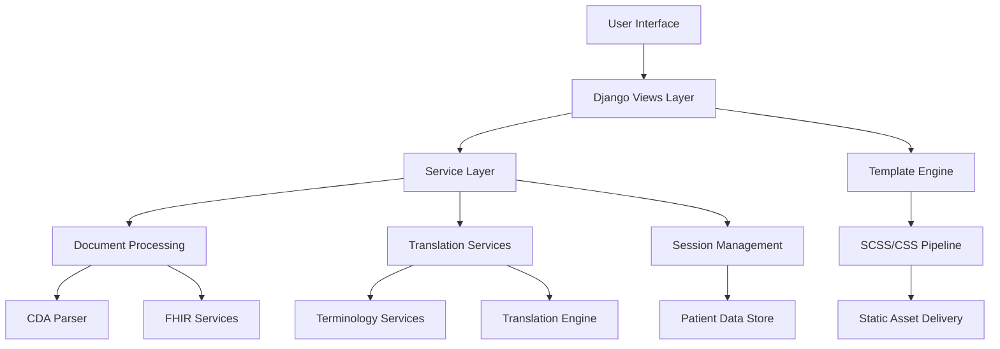
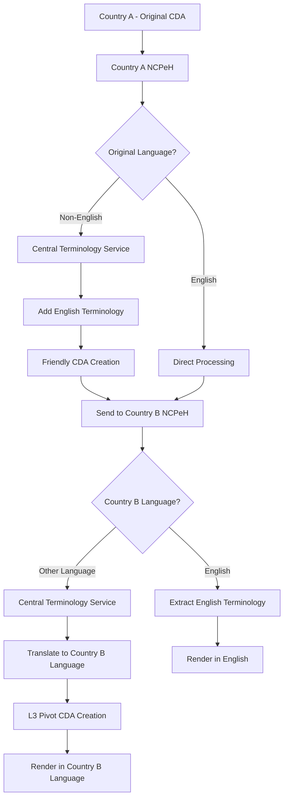
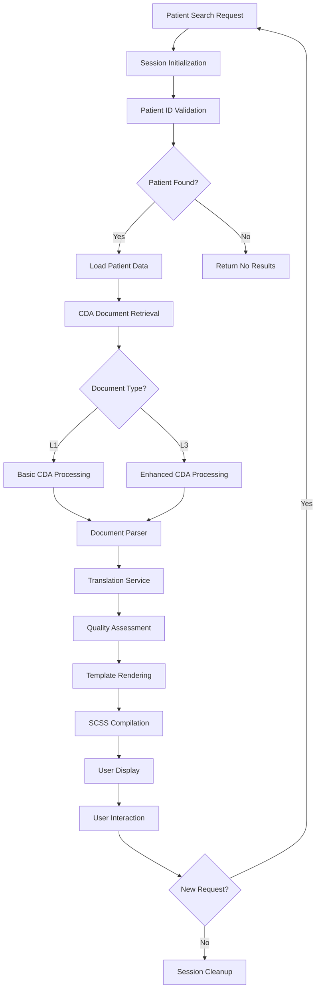
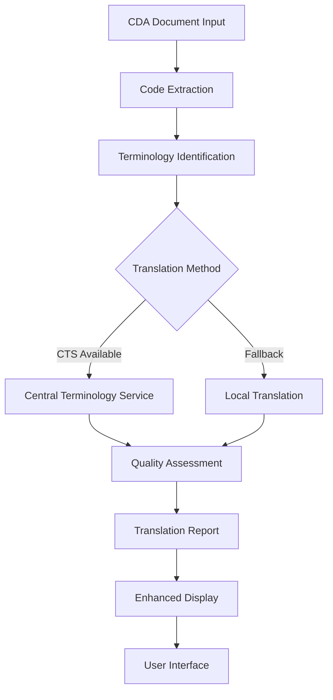
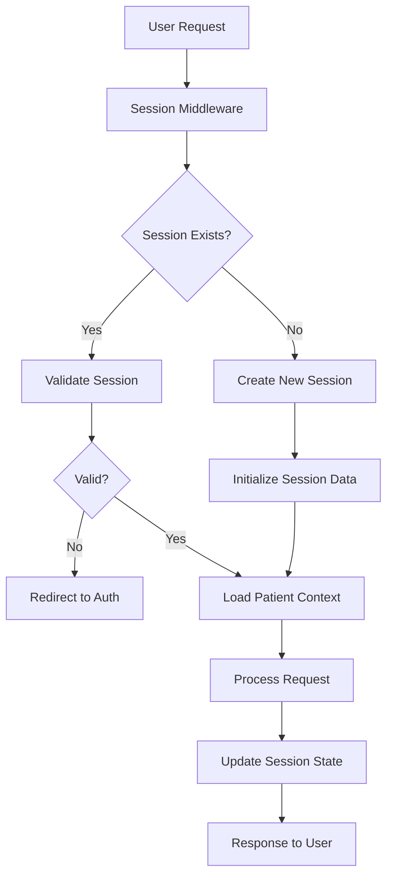

# Django NCP Technical Architecture & Information Flow

## Overview

This document provides a comprehensive technical architecture guide for the Django NCP (National Contact Point) system, consolidating information flows, processing pipelines, and component interactions. It serves as the single source of truth for understanding how information moves through the system.

## System Architecture Overview

### Core Components Architecture



### Information Flow Layers

1. **Presentation Layer** - Templates, SCSS, JavaScript, User Interface
2. **Controller Layer** - Django Views, URL Routing, Session Management
3. **Service Layer** - Business Logic, Data Processing, External APIs
4. **Data Layer** - Document Storage, Session Data, Configuration
5. **External Layer** - CDA Documents, FHIR Services, Translation APIs

## Central Terminology Service Architecture

### NCPeH Terminology Processing Flow

The European NCP (National Contact Point for eHealth) system utilizes a Central Terminology Service for multilingual medical terminology support across Member States. This architecture ensures proper medical terminology translation and consistency.

#### Terminology Service Flow Diagram



#### Terminology Processing Stages

**Stage 1: Country A (Source) - Friendly CDA Creation**

- Original CDA contains coded structured data in native language
- Central Terminology Service matches codes to National Medicinal Catalogues
- English terminology added alongside original language
- Result: "Friendly CDA" with dual-language terminology

**Stage 2: Cross-Border Transmission**

- Friendly CDA transmitted from Country A NCPeH to Country B NCPeH
- Contains both original language and English terminology
- Medical codes preserved for terminology consistency

**Stage 3: Country B (Destination) - Language Adaptation**

- **If English-speaking**: Extract English terminology directly from Friendly CDA
- **If Non-English**: Use Central Terminology Service to translate English to local language
- Create L3 Pivot CDA with appropriate language terminology
- Render patient summary in Country B's language

#### Implementation in Django NCP (English-Speaking Member State)

Since our Django NCP application represents an English-speaking Member State:

**Receiving Data (from affiliate countries):**

```python
# Process incoming Friendly CDA documents
# Extract English terminology directly from dual-language structure
# No translation required - use English terminology as provided
```

**Sending Data (to other Member States):**

```python
# Our original CDA documents are already in English
# No Central Terminology Service required for outgoing data
# Receiving Member State handles translation if needed
```

#### Architectural Principles

1. **No Hardcoded Terminology**: All medical terminology must come from CDA documents or Central Terminology Service
2. **Code-Based Terminology**: Use medical codes (SNOMED CT, ICD-10, etc.) as the foundation for terminology
3. **Language Agnostic Processing**: System processes structured data, not language-specific content
4. **Terminology Separation**: Terminology logic belongs in dedicated services, not in views or templates

## Patient Data Processing Flow

### Complete Patient Journey



### Patient Data Sources & Processing

#### 1. Patient Search & Identification

**Flow:** `User Input → Session Validation → Patient Lookup → Data Retrieval`

```python
# Key Components:
patient_data/views.py::patient_search_view()
  ↓
patient_data/services/patient_service.py::search_patients()
  ↓
Session Management (eu_ncp_server/session_manager.py)
  ↓
Patient Data Matching & Retrieval
```

#### 2. CDA Document Processing Pipeline

**Process Flow for English-speaking Country B (Django NCP):**
`Raw CDA XML → Parsing → Terminology Extraction → Template Rendering → User Display`

**Process Flow for non-English speaking Country B:**
`Raw CDA XML → Parsing → Translation → Terminology Extraction → Template Rendering → User Display`

```python
# Core Processing Chain:
Raw CDA Document (XML)
  ↓
CDAProcessor (patient_data/document_services.py)
  ├── parse_cda_document() - Extract metadata
  ├── _extract_patient_info() - Patient demographics
  ├── _extract_sections() - Clinical sections
  └── _is_level3() - Document type detection
  ↓
Language Detection & Processing
  ├── English-speaking: Direct Terminology Extraction
  └── Non-English: Translation Service → Terminology Extraction
  ↓
Central Terminology Service
  ├── extract_medical_codes_from_fields() - Medical code extraction
  ├── extract_condition_terminology() - Condition codes
  └── extract_procedure_terminology() - Procedure codes
  ↓
Template Rendering (templates/patient_data/) - Django Template Engine
  ├── enhanced_patient_cda.html - Main template
  ├── patient_details.html - Detail view
  └── Component templates
  ↓
SCSS Compilation (static/scss/)
  ├── pages/_patient_cda.scss - Page-specific styles
  ├── components/ - Reusable components
  └── utils/ - Variables and mixins
```

## CDA Document Architecture

### Document Type Processing Matrix

| Document Level | Processing Method | Template | SCSS File | Output Format |
|----------------|------------------|----------|-----------|---------------|
| **L1 (Basic)** | `CDAProcessor.parse_cda_document()` | `patient_details.html` | `_patient_cda.scss` | Basic Patient Summary |
| **L3 (Enhanced)** | `EnhancedCDAProcessor.process_clinical_sections()` | `enhanced_patient_cda.html` | `_enhanced_cda.scss` | Rich Clinical Data |

### CDA Processing Flow Detail

#### Phase 1: Document Ingestion

```python
# File: patient_data/views.py
upload_cda_document(request)
  ↓
File Validation & Storage (media/uploads/cda_documents/)
  ↓
Automatic Processing (if auto_process=True)
  ↓
EnhancedCDAProcessor.process_cda_file()
```

#### Phase 2: XML Parsing & Structure Analysis

```python
# File: patient_data/document_services.py
CDAProcessor.__init__()
  ├── namespaces = {"cda": "urn:hl7-org:v3", "xsi": "..."}
  └── Document structure validation

parse_cda_document(cda_content)
  ├── XML parsing with error handling
  ├── Patient info extraction (_extract_patient_info)
  ├── Author info extraction (_extract_author_info)
  ├── Clinical sections extraction (_extract_sections)
  └── Document type detection (_is_level3)
```

#### Phase 3: Translation & Enhancement

```python
# File: translation_services/
TerminologyTranslatorCompat (compatibility bridge)
  ↓
TerminologyTranslator (CTS-based architecture)
  ├── extract_codes() - Medical code extraction
  ├── translate_terminology() - CTS lookup
  ├── assess_translation_quality() - Quality metrics
  └── generate_translation_report() - Detailed analysis
```

#### Phase 4: Rendering & Display

```python
# Templates: templates/patient_data/
enhanced_patient_cda.html
  ├── Patient header section
  ├── Clinical tabs (Overview, Administrative, Extended)
  ├── Contact information display
  └── Document metadata

# Styling: static/scss/pages/
_enhanced_cda.scss
  ├── Layout and typography
  ├── Tab navigation styles
  ├── Clinical section formatting
  └── Responsive design rules
```

## Translation Services Architecture

### Translation Pipeline Flow



### Service Components Detail

#### 1. Translation Service Integration

**Location:** `translation_services/enhanced_translation_service.py`

```python
# Core Architecture:
class EnhancedTranslationService:
    ├── process_document() - Main entry point
    ├── analyze_sections() - Section-by-section analysis
    ├── apply_terminology_translation() - Medical term processing
    ├── assess_translation_quality() - Quality metrics
    └── generate_enhanced_view() - UI preparation

# Key Features:
- Multi-language support
- Medical terminology accuracy
- Quality scoring (1-10 scale)
- Fallback translation methods
- Error handling and logging
```

#### 2. Terminology Management

**Location:** `translation_services/terminology_translator.py`

```python
# CTS-Based Architecture (Post-Fix):
class TerminologyTranslatorCompat:
    ├── translate_text_block() - Compatibility method
    ├── translate_term() - Individual term translation
    └── _delegate_to_cts() - CTS service calls

class TerminologyTranslator:
    ├── Central Terminology Service integration
    ├── Medical code system support (SNOMED, ICD-10, LOINC)
    ├── Quality assessment algorithms
    └── Caching for performance
```

## Frontend Architecture & Asset Pipeline

### SCSS Architecture Consolidation

#### Current State Analysis (from retro-spec.md)

- ⚠️ **Inline CSS**: Some templates still contain `<style>` blocks
- ⚠️ **Inline JS**: Some templates contain `<script>` tags
- ✅ **SASS Variables**: HSE color palette implemented
- ✅ **Compilation Pipeline**: Working SASS → CSS compilation

#### Unified SCSS Structure

```scss
// File: static/scss/main.scss (Entry Point)
@import 'utils/variables';     // HSE colors, breakpoints
@import 'utils/mixins';        // Reusable SASS mixins
@import 'base/reset';          // Normalize/reset styles
@import 'base/typography';     // Typography system
@import 'base/accessibility';  // WCAG compliance
@import 'components/buttons';  // Interactive elements
@import 'components/forms';    // Form styling
@import 'components/cards';    // Card components
@import 'components/tables';   // Data tables
@import 'layouts/grid';        // Layout system
@import 'layouts/header';      // Site header
@import 'pages/patient_cda';   // CDA-specific styles
@import 'pages/enhanced_cda';  // Enhanced CDA styles
```

#### Component Architecture Integration

**Integration with .specs Documentation:**

- Follows [SCSS Architecture Standards](scss-architecture-standards.md)
- Implements [SCSS Component Patterns](scss-component-patterns.md)
- Uses [SCSS Quick Reference](scss-quick-reference.md) guidelines

**Key Architectural Principles:**

- **Dynamic Components**: Context-aware styling with smart color adaptation
- **Modular Design**: Single responsibility, reusable components
- **Zero Duplication**: No repeated CSS patterns
- **Variable-Driven**: HSE color palette and design tokens

### Asset Compilation Pipeline

#### Development Workflow

```bash
# Watch mode for active development
sass --watch static/scss:static/css

# VS Code task integration
"Compile SASS" task → background compilation
"Compile SASS (One-time)" task → production build
```

#### Production Build Process

```bash
# Complete build pipeline
sass static/scss:static/css
python manage.py collectstatic --noinput

# Integrated build (from tasks.json)
sass static/scss:static/css && python manage.py collectstatic --noinput
```

### Template Architecture Integration

#### Template Hierarchy & Inheritance

```html
<!-- Base Template Structure -->
templates/
├── base.html                    # Site-wide base template
├── patient_data/
│   ├── base_patient.html       # Patient section base
│   ├── patient_details.html    # Basic patient view
│   ├── enhanced_patient_cda.html # Enhanced CDA display
│   └── components/             # Reusable components
│       ├── patient_header.html
│       ├── clinical_tabs.html
│       └── contact_cards.html
```

#### Template-SCSS Integration Pattern

```html
<!-- Template: enhanced_patient_cda.html -->
<div class="cda-container">
  <header class="cda-header">
    <h1 class="cda-title">{{ patient_data.display_name }}</h1>
  </header>

  <section class="patient-info-section">
    <!-- Patient data display -->
  </section>

  <nav class="clinical-tabs">
    <!-- Tab navigation -->
  </nav>
</div>
```

```scss
// Corresponding SCSS: _enhanced_cda.scss
.cda-container {
  @include container-foundation;
  max-width: 1400px;
  margin: 0 auto;
}

.cda-header {
  @include gradient-header($hse-primary, $hse-secondary);
  color: white;
  padding: 1.5rem;
}

.patient-info-section {
  @include card-foundation;
  @include responsive-grid(1fr 1fr, mobile: 1fr);
}
```

## Session Management Architecture

### Session Flow & Security

#### Session Lifecycle Management



#### Session Data Structure

**Location:** `eu_ncp_server/session_manager.py`

```python
# Session Data Schema:
request.session = {
    'patient_data': {
        'patient_id': 'unique_identifier',
        'display_name': 'Patient Name (Anonymized)',
        'session_token': 'secure_token',
        'cda_documents': {
            'l1_documents': [...],
            'l3_documents': [...],
            'selected_l1_index': 0,
            'selected_l3_index': 0
        },
        'translation_cache': {...},
        'last_activity': timestamp
    },
    'security_context': {
        'authenticated': bool,
        'csrf_token': 'token',
        'ip_address': 'user_ip',
        'user_agent': 'browser_info'
    }
}
```

### Patient Privacy & Security Architecture

#### Privacy Protection Measures

1. **Data Anonymization**: No personal names in code/comments/logs
2. **Session Isolation**: Patient data isolated to session context
3. **Secure Tokens**: Cryptographically secure session tokens
4. **Access Control**: Authentication required for patient data access
5. **Data Cleanup**: Automatic session cleanup on timeout/logout

#### Security Implementation

```python
# File: patient_data/views.py
@require_http_methods(["GET", "POST"])
@csrf_protect
def patient_cda_view(request, patient_id, cda_type=None):
    # Authentication check
    if not request.user.is_authenticated:
        return redirect('authentication:login')

    # Session validation
    session_data = request.session.get('patient_data', {})
    if not session_data.get('session_token'):
        return redirect('patient_data:patient_search')

    # Patient ID validation
    if session_data.get('patient_id') != patient_id:
        return redirect('patient_data:patient_search')
```

## Performance Architecture & Optimization

### Database Query Optimization Patterns

#### Efficient Data Retrieval

```python
# Optimized query patterns from views.py:
def patient_search_view(request):
    # Single query with select_related for foreign keys
    patients = Patient.objects.select_related('contact', 'address').filter(...)

    # Prefetch related data to avoid N+1 queries
    patients = patients.prefetch_related('documents', 'translations')

    # Use pagination for large result sets
    paginator = Paginator(patients, 25)
    page_obj = paginator.get_page(page_number)
```

#### Caching Strategy

```python
# Translation result caching
from django.core.cache import cache

def get_cached_translation(document_id, language):
    cache_key = f"translation_{document_id}_{language}"
    cached_result = cache.get(cache_key)

    if cached_result is None:
        # Perform translation
        result = translate_document(document_id, language)
        cache.set(cache_key, result, timeout=3600)  # 1 hour
        return result

    return cached_result
```

### Asset Loading Optimization

#### SCSS Compilation Performance

```scss
// Optimized import order in main.scss:
@import 'utils/variables';      // First: variables needed everywhere
@import 'utils/mixins';         // Second: mixins that use variables
@import 'base/reset';           // Third: foundational styles
@import 'base/typography';      // Fourth: typography system
// ... component imports ordered by dependency
@import 'pages/patient_cda';    // Last: page-specific styles
```

#### Static File Serving

```python
# Production static file configuration
STATIC_ROOT = os.path.join(BASE_DIR, 'staticfiles')
STATICFILES_STORAGE = 'django.contrib.staticfiles.storage.StaticFilesStorage'

# Development static file serving
if DEBUG:
    urlpatterns += static(settings.STATIC_URL, document_root=settings.STATIC_ROOT)
```

## Error Handling & Logging Architecture

### Comprehensive Error Management

#### Error Handling Strategy

```python
# Layered error handling approach:

# 1. View Level - User-friendly error responses
def patient_cda_view(request, patient_id, cda_type=None):
    try:
        # Main processing logic
        return render(request, template, context)
    except PatientNotFoundError:
        messages.error(request, "Patient not found.")
        return redirect('patient_data:patient_search')
    except CDAProcessingError as e:
        logger.error(f"CDA processing failed for {patient_id}: {e}")
        messages.error(request, "Unable to process patient document.")
        return render(request, 'error.html', {'error': e})

# 2. Service Level - Business logic error handling
class CDAProcessor:
    def parse_cda_document(self, cda_content):
        try:
            # XML parsing logic
            return parsed_data
        except ET.ParseError as e:
            logger.warning(f"Invalid XML structure: {e}")
            raise CDAProcessingError(f"Document format error: {e}")
        except Exception as e:
            logger.error(f"Unexpected parsing error: {e}")
            raise CDAProcessingError("Unable to process document")

# 3. Template Level - Graceful degradation

    

    <div class="alert alert-warning">
        <p>Document not available for display.</p>
    </div>

```

#### Logging Configuration

```python
# Structured logging setup
LOGGING = {
    'version': 1,
    'disable_existing_loggers': False,
    'handlers': {
        'file': {
            'level': 'INFO',
            'class': 'logging.FileHandler',
            'filename': 'logs/django_ncp.log',
        },
        'console': {
            'level': 'DEBUG',
            'class': 'logging.StreamHandler',
        },
    },
    'loggers': {
        'patient_data': {
            'handlers': ['file', 'console'],
            'level': 'INFO',
            'propagate': True,
        },
        'translation_services': {
            'handlers': ['file'],
            'level': 'WARNING',
            'propagate': True,
        },
    },
}
```

## Testing Architecture Integration

### Test Structure & Coverage

#### Testing Strategy (from .specs requirements)

**Mandatory Testing Components:**

- **Unit Tests**: Every view, service, mixin tested in isolation
- **Integration Tests**: Complete user workflow validation
- **Security Tests**: Authentication, authorization, CSRF protection
- **Performance Tests**: Response time and database query optimization

#### Test Organization

```python
# File structure following testing standards:
tests/
├── test_patient_views.py           # View layer testing
├── test_cda_services.py           # CDA processing services
├── test_translation_services.py   # Translation engine testing
├── test_session_management.py     # Session security testing
├── test_scss_compilation.py       # Frontend asset testing
└── test_integration_workflows.py  # End-to-end testing
```

#### Test Implementation Pattern

```python
# Example: Modular test structure
class PatientCDAViewTests(TestCase):
    def setUp(self):
        self.client = Client()
        self.user = User.objects.create_user(...)
        self.test_patient_data = {...}

    def test_authenticated_access_only(self):
        """Verify authentication requirement"""
        response = self.client.get('/patients/cda/12345/')
        self.assertEqual(response.status_code, 302)  # Redirect to login

    @patch('patient_data.services.CDAProcessor.parse_cda_document')
    def test_cda_document_processing(self, mock_parser):
        """Test CDA processing integration"""
        mock_parser.return_value = self.test_patient_data
        self.client.login(...)
        response = self.client.get('/patients/cda/12345/')
        self.assertEqual(response.status_code, 200)
        self.assertIn('patient_identity', response.context)
```

## TODO Management & Workload Tracking

### Current TODO Status (from retro-spec.md)

#### ⚠️ In Progress Items

1. **Remove remaining inline CSS** → Move to `/static/sass/` and compile
2. **Remove remaining inline JS** → Move to `/static/js/`
3. **Refactor FBVs into CBVs** → Where reuse is beneficial
4. **Simplify remaining templates** → Move logic into Python

#### ❌ Outstanding Requirements

1. **Replace mock data** → Use real DB queries or API calls
2. **Add unit tests** → For each function/class
3. **Set up pre-commit hooks** → Linting and security checks

#### ✅ Completed Achievements

1. **Git workflow established** → Small incremental commits
2. **Navigation enhanced** → HSE-themed, accessible, mobile-responsive
3. **HSE colour palette adopted** → SASS variables and navigation
4. **Documentation structure** → `/docs/` with to-do lists and decisions

### Workload Management Integration

#### Priority Matrix (High to Low)

1. **Testing Implementation** - [Testing and Modular Code Standards](testing-and-modular-code-standards.md)
2. **Inline CSS/JS Removal** - Frontend structure compliance
3. **Mock Data Replacement** - Real data integration
4. **View Refactoring** - CBV conversion for reusability
5. **Pre-commit Hooks** - Automated quality gates

#### Integration with .specs Documentation

- **Starter Prompt Integration**: All TODO items reference [Starter Prompt](starter-prompt.md) workflow
- **Feature Template Usage**: New features follow [Feature Template](feature-template.md) requirements
- **Quality Gates**: All items must pass quality gates in [Comprehensive Development Methodology](comprehensive-development-methodology.md)

## Architecture Evolution & Future Planning

### Planned Architectural Improvements

#### Short-term Enhancements (Next 3 months)

1. **Complete SCSS Migration**: Eliminate all inline CSS/JS
2. **Service Layer Expansion**: Extract more business logic from views
3. **Testing Framework**: Implement comprehensive test coverage
4. **Performance Optimization**: Database query optimization and caching

#### Medium-term Evolution (3-6 months)

1. **Microservice Architecture**: Separate translation services
2. **API-First Design**: REST API for all patient data operations
3. **Advanced Caching**: Redis integration for translation caching
4. **Real-time Features**: WebSocket integration for live updates

#### Long-term Vision (6+ months)

1. **Container Orchestration**: Docker/Kubernetes deployment
2. **Multi-tenant Support**: Multiple healthcare organization support
3. **Advanced Analytics**: Patient data analytics and reporting
4. **Mobile Application**: Native mobile app for healthcare providers

### Architectural Decision Log

| Date | Decision | Rationale | Impact |
|------|----------|-----------|---------|
| 2025-09-24 | Consolidated CSS Architecture | Multiple overlapping stylesheets causing confusion | Single source of truth for styling |
| 2025-09-24 | CTS-Based Translation | Removed hardcoded French dictionaries | Medical credibility and accuracy |
| 2025-09-24 | SCSS Architecture Standards | Need for consistent, modular styling | Maintainable, scalable CSS system |
| 2025-09-24 | Testing & Modularity Standards | Code quality and maintainability requirements | Professional-grade development workflow |

## Conclusion

This technical architecture documentation consolidates all aspects of the Django NCP system into a cohesive understanding of:

- **Information Flow**: How data moves from input to display
- **Component Integration**: How services, views, and templates work together
- **Asset Pipeline**: How SCSS compiles to CSS and integrates with templates
- **Security Architecture**: How sessions, authentication, and privacy are managed
- **Performance Patterns**: How the system optimizes for speed and efficiency
- **Quality Assurance**: How testing and code quality are maintained
- **Evolution Planning**: How the system will grow and improve over time

By following this architectural guide, developers can understand the complete system context and make informed decisions about implementation, testing, and enhancement of the Django NCP healthcare platform.

## Integration References

- **[Retro-Spec Current State](retro-spec.md)** - Current implementation status
- **[SCSS Architecture Standards](scss-architecture-standards.md)** - Frontend styling requirements
- **[Testing and Modular Code Standards](testing-and-modular-code-standards.md)** - Backend quality requirements
- **[Comprehensive Development Methodology](comprehensive-development-methodology.md)** - Complete development workflow
- **[Starter Prompt](starter-prompt.md)** - Development session initialization
