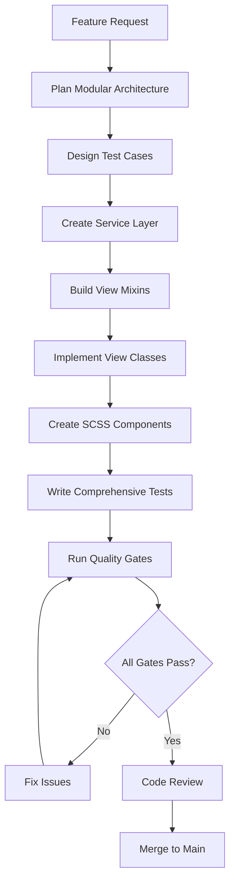

# Comprehensive Development Methodology - Django NCP

## Mission Statement

**"Dynamic, modular, reusable components that are never duplicated or programmed ad-hoc"**

This specification defines the complete development methodology for Django NCP, integrating **testing requirements**, **modular architecture**, **SCSS standards**, and **quality assurance** into a cohesive system that ensures professional-grade code with zero technical debt.

## Integration Architecture

### 🎯 Core Methodology Pillars

1. **Testing-First Development**
   - Every view/component has comprehensive unit tests
   - Integration testing for complete workflows
   - Security testing for all user interactions
   - Performance testing with defined benchmarks

2. **Modular Code Architecture**
   - Class-based views with mixin composition
   - Service layer for business logic
   - No view functions over 50 lines
   - Single responsibility principle

3. **Dynamic SCSS Components**
   - Context-aware styling systems
   - Zero CSS duplication
   - Healthcare colour palette integration
   - Mobile-first responsive design

4. **Quality Assurance Pipeline**
   - Automated testing before merge
   - Code review with mandatory checklist
   - Performance benchmarking
   - Security validation

## Workflow Integration

### 📋 Every Development Session Checklist

**Before Starting Any Code:**

- [ ] Review [Testing and Modular Code Standards](./testing-and-modular-code-standards.md) requirements
- [ ] Check [SCSS Quick Reference](./scss-quick-reference.md) for styling guidelines
- [ ] Plan modular architecture with reusable components
- [ ] Design test cases alongside feature planning

**During Development:**

- [ ] Write tests before implementation (TDD approach)
- [ ] Use class-based views with mixin patterns
- [ ] Extract business logic to service classes
- [ ] Follow SCSS component patterns for styling
- [ ] Keep view functions under 50 lines

**Before Committing:**

- [ ] Run complete test suite (`python manage.py test`)
- [ ] Verify SCSS compilation (`sass static/scss:static/css`)
- [ ] Check code coverage meets requirements
- [ ] Validate performance benchmarks
- [ ] Review security measures

### 🔄 Feature Development Pipeline



## Specification Interaction Map

### 🏗️ Backend Development Stack

```
[Testing and Modular Code Standards] ←→ [View Function Standards]
              ↓                                    ↓
[Feature Template]                    ←→    [API Response Standards]
              ↓                                    ↓
[Error Handling Standards]            ←→    [Database Query Optimization]
```

### 🎨 Frontend Development Stack

```
[SCSS Architecture Standards]        ←→    [SCSS Component Patterns]
              ↓                                    ↓
[SCSS Quick Reference]                ←→    [Icon Centering Standards]
              ↓                                    ↓
[Frontend Structure Compliance]      ←→    [Django Template Standards]
```

### 🔗 Integration Layer

```
[Starter Prompt] ←→ [Testing & Modular Architecture] ←→ [SCSS Standards]
              ↓                                    ↓                 ↓
[Feature Template]            ←→            [Quality Gates]       ←→ [Git Workflow]
```

## Component Reusability Matrix

### 🧩 Backend Components

| Component Type | Reusability Pattern | Testing Requirement | Example |
|----------------|-------------------|-------------------|---------|
| **View Mixins** | Inherit in multiple views | Unit tests for each method | `PatientDataMixin`, `SessionValidationMixin` |
| **Service Classes** | Static/class methods | Comprehensive business logic tests | `PatientDataService`, `SessionManagementService` |
| **Utility Functions** | Import across modules | Edge case and error testing | `validate_patient_id()`, `format_cda_data()` |
| **Base Classes** | Template method pattern | Integration and inheritance tests | `BasePatientView`, `BaseCDAProcessor` |

### 🎨 Frontend Components

| Component Type | Reusability Pattern | SCSS Architecture | Testing Approach |
|----------------|-------------------|------------------|------------------|
| **UI Components** | Context-aware classes | `@include smart-icon-color()` | Visual regression testing |
| **Layout Mixins** | Foundation patterns | `@include card-foundation` | Responsive design testing |
| **Color Systems** | Variable-driven design | `$hco-primary-blue` variables | Accessibility testing |
| **Icon Systems** | Smart color adaptation | `@include perfect-icon-center` | Cross-browser validation |

## Quality Gates Integration

### ✅ Mandatory Pre-Merge Checklist

**Architecture Compliance:**

- [ ] **Modularity**: View functions under 50 lines, business logic in services
- [ ] **Reusability**: Common patterns extracted to mixins/utilities
- [ ] **Single Responsibility**: Each component has one clear purpose
- [ ] **Dependency Injection**: Testable, flexible relationships

**Testing Requirements:**

- [ ] **Unit Tests**: 100% coverage for new code
- [ ] **Integration Tests**: Complete workflow validation
- [ ] **Security Tests**: Authentication, authorization, input validation
- [ ] **Performance Tests**: Response time and query optimization

**SCSS Compliance:**

- [ ] **Context-Aware**: Components work on light/dark backgrounds
- [ ] **Mobile-First**: Responsive design with breakpoint mixins
- [ ] **Zero Duplication**: No repeated CSS patterns
- [ ] **Healthcare Branding**: Colour palette and design system compliance

**Documentation Standards:**

- [ ] **Code Comments**: Clear purpose and usage explanations
- [ ] **Docstrings**: Comprehensive method/class documentation
- [ ] **Specification Updates**: Related specs updated with changes
- [ ] **README Updates**: Installation and usage instructions current

## Development Environment Setup

### 🛠️ Required Tools and Commands

**Backend Development:**

```bash
# Virtual environment setup
python -m venv django_ncp_env
source django_ncp_env/bin/activate  # Linux/Mac
django_ncp_env\Scripts\activate     # Windows

# Install dependencies
pip install -r requirements.txt

# Database setup
python manage.py migrate

# Testing pipeline
python manage.py test                    # All tests
python manage.py test --coverage        # Coverage analysis
python manage.py check --deploy        # Security validation
```

**Frontend Development:**

```bash
# SCSS compilation
sass --watch static/scss:static/css     # Development mode
sass static/scss:static/css              # Production build

# Static files
python manage.py collectstatic --noinput

# Combined build
sass static/scss:static/css && python manage.py collectstatic --noinput
```

**Quality Assurance:**

```bash
# Pre-commit validation
python manage.py test && \
sass static/scss:static/css && \
python manage.py collectstatic --noinput && \
python manage.py check --deploy
```

## Success Metrics

### 📊 Quantitative Goals

**Code Quality:**

- Test Coverage: 100% for new code, 95%+ project-wide
- Modularity: Average view function length < 30 lines
- Reusability: 80%+ common functionality in shared components
- Performance: <1s response times, <5 DB queries per view

**Development Efficiency:**

- Feature Development: 50% faster with reusable components
- Bug Resolution: 75% reduction through comprehensive testing
- Maintenance: 60% less time on bug fixes and updates
- Code Review: 90% pass rate on first review

**User Experience:**

- Accessibility: WCAG 2.1 AA compliance
- Performance: 95+ Lighthouse scores
- Mobile Experience: 100% responsive design compliance
- Cross-Browser: Support for 95%+ user browsers

### 🎯 Qualitative Objectives

**Maintainability:**

- Clear, self-documenting code with minimal cognitive load
- Consistent patterns across the entire codebase
- Easy onboarding for new developers
- Minimal technical debt accumulation

**Scalability:**

- Architecture supports unlimited feature growth
- Performance remains consistent with increased load
- Easy integration of new technologies
- Flexible deployment configurations

**Team Productivity:**

- Reduced debugging time through comprehensive testing
- Faster feature development with reusable components
- Clear documentation reduces knowledge transfer time
- Automated quality gates prevent regression issues

## Continuous Improvement

### 🔄 Regular Review Process

**Weekly Reviews:**

- Code quality metrics analysis
- Test coverage assessment
- Performance benchmark evaluation
- Developer feedback collection

**Monthly Assessments:**

- Architecture pattern effectiveness
- Reusable component usage statistics
- SCSS component library audit
- Documentation completeness review

**Quarterly Evolution:**

- Specification updates based on learning
- Tool and technology evaluation
- Process optimization opportunities
- Training and skill development planning

### 🚀 Future Enhancements

**Automation Improvements:**

- Enhanced pre-commit hooks
- Automated performance regression testing
- Visual regression testing for SCSS components
- Continuous integration pipeline optimization

**Architecture Evolution:**

- Microservice pattern exploration
- Advanced caching strategies
- GraphQL API integration
- Progressive web app features

**Quality Assurance Enhancement:**

- Advanced security testing automation
- Load testing integration
- Accessibility testing automation
- Cross-browser testing pipeline

## Conclusion

This comprehensive development methodology ensures Django NCP maintains the highest standards of code quality, performance, and maintainability. By integrating testing, modularity, and SCSS architecture into a cohesive system, we achieve:

- **Professional-Grade Code**: Every component follows established patterns
- **Zero Technical Debt**: No duplicate code or ad-hoc solutions
- **Comprehensive Quality**: Testing covers all aspects of functionality
- **Scalable Architecture**: Modular design supports unlimited growth
- **Team Efficiency**: Clear standards reduce development time and errors

The result is a robust, maintainable healthcare application that serves users reliably while remaining efficient to develop and maintain over time.

### 📚 Master Reference Index

**Core Standards:**

- [Testing and Modular Code Standards](./testing-and-modular-code-standards.md)
- [Testing and Modularity Index](./testing-and-modularity-index.md)
- [SCSS Architecture Standards](./scss-architecture-standards.md)
- [SCSS Standards Index](./scss-standards-index.md)

**Implementation Guides:**

- [SCSS Component Patterns](./scss-component-patterns.md)
- [SCSS Quick Reference](./scss-quick-reference.md)
- [Feature Template](./feature-template.md)
- [Starter Prompt](./starter-prompt.md)

**Quality Assurance:**

- [View Function Standards](./view-function-standards.md)
- [Error Handling Standards](./error-handling-standards.md)
- [Database Query Optimization](./database-query-optimization.md)
- [Frontend Structure Compliance](./frontend-structure-compliance.md)
