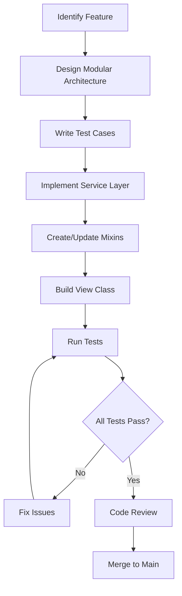

# Testing and Modular Code Standards - Django NCP

## Overview

This specification defines **mandatory testing and modular code requirements** for all Django NCP development. Every view function modification or creation **must** include corresponding tests and follow modular, reusable patterns. This ensures maintainable, testable, and scalable code architecture.

## Core Principles

### 1. Modular Code Architecture

- **Single Responsibility Principle**: Each function/class has one clear purpose
- **Reusable Components**: Leverage classes and mixins for common patterns
- **No Monolithic Functions**: Break down large view functions into smaller, testable components
- **DRY Principle**: Never duplicate functionality - extract to reusable classes/methods

### 2. Mandatory Testing

- **Every View Must Have Tests**: Unit tests required for all view functions/classes
- **Test-Driven Development**: Write tests alongside code, not as an afterthought
- **Comprehensive Coverage**: Unit, integration, and security testing
- **Automated Testing**: All tests must pass before code merge

### 3. View Function Standards

- **Maximum 50 Lines**: Large view functions must be refactored into smaller components
- **Class-Based Views Preferred**: Use Django CBVs for complex functionality
- **Mixin Pattern**: Extract common functionality to reusable mixins
- **Clear Separation**: Business logic separate from presentation logic

## View Architecture Patterns

### 1. Class-Based View Structure

**Mandatory Pattern**: All complex views must use this modular structure:

```python
# ✅ CORRECT: Modular class-based view
from django.views.generic import TemplateView
from django.contrib.auth.mixins import LoginRequiredMixin
from ..mixins import PatientDataMixin, SessionValidationMixin

class PatientCDAView(LoginRequiredMixin, PatientDataMixin, SessionValidationMixin, TemplateView):
    """
    Display CDA document for authenticated users.

    Mixins:
    - LoginRequiredMixin: Ensures user authentication
    - PatientDataMixin: Provides patient data retrieval methods
    - SessionValidationMixin: Validates session integrity
    """
    template_name = 'patient_data/enhanced_patient_cda.html'

    def get_context_data(self, **kwargs):
        """Build context data using modular methods."""
        context = super().get_context_data(**kwargs)

        # Use mixin methods for modular data retrieval
        context.update({
            'patient_identity': self.get_patient_identity(),
            'cda_document': self.get_cda_document(),
            'translation_quality': self.get_translation_quality(),
            'source_country': self.get_source_country(),
        })

        return context

    def get_patient_identity(self):
        """Extract patient identity using reusable logic."""
        # Modular method - can be reused across views
        pass

    def get_cda_document(self):
        """Retrieve CDA document with error handling."""
        # Modular method - testable in isolation
        pass
```

### 2. Mixin Architecture

**Mandatory Pattern**: Extract common functionality to reusable mixins:

```python
# mixins.py - Reusable view components
class PatientDataMixin:
    """Reusable mixin for patient data operations."""

    def get_patient_identity(self):
        """Standardized patient identity retrieval."""
        patient_id = self.kwargs.get('patient_id')
        return self.retrieve_patient_data(patient_id)

    def retrieve_patient_data(self, patient_id):
        """Core patient data retrieval logic."""
        # Reusable across multiple views
        pass

    def validate_patient_access(self, patient_id):
        """Security validation for patient data access."""
        # Centralized security logic
        pass

class SessionValidationMixin:
    """Reusable session validation logic."""

    def dispatch(self, request, *args, **kwargs):
        """Validate session before processing request."""
        if not self.is_valid_session(request):
            return self.handle_invalid_session(request)
        return super().dispatch(request, *args, **kwargs)

    def is_valid_session(self, request):
        """Session validation logic."""
        # Reusable session validation
        pass

    def handle_invalid_session(self, request):
        """Standardized invalid session handling."""
        # Consistent error handling
        pass

class CDAProcessingMixin:
    """Reusable CDA document processing logic."""

    def process_cda_document(self, document):
        """Standardized CDA processing."""
        # Complex logic extracted to reusable component
        pass

    def extract_patient_summary(self, cda_document):
        """Extract patient summary from CDA."""
        # Modular extraction logic
        pass
```

### 3. Service Layer Pattern

**Mandatory Pattern**: Complex business logic in dedicated service classes:

```python
# services.py - Business logic layer
class PatientDataService:
    """Service class for patient data operations."""

    @staticmethod
    def get_patient_cda_document(patient_id, document_type='L3'):
        """
        Retrieve CDA document for patient.

        Args:
            patient_id (str): Patient identifier
            document_type (str): 'L1' or 'L3' document type

        Returns:
            dict: Processed CDA document data

        Raises:
            PatientNotFoundError: If patient doesn't exist
            CDAProcessingError: If document processing fails
        """
        # Modular business logic
        pass

    @classmethod
    def validate_patient_session(cls, session_data, patient_id):
        """Validate patient session integrity."""
        # Reusable validation logic
        pass

    def process_l3_document(self, raw_document):
        """Process L3 patient summary document."""
        # Specific processing logic
        pass

class SessionManagementService:
    """Service for session operations."""

    @staticmethod
    def create_patient_session(patient_data):
        """Create standardized patient session."""
        pass

    @staticmethod
    def validate_session_token(token):
        """Validate session token security."""
        pass
```

## Testing Architecture

### 1. Mandatory Test Structure

**Every view/service must have comprehensive tests**:

```python
# tests/test_patient_views.py
from django.test import TestCase, Client
from django.urls import reverse
from django.contrib.auth.models import User
from unittest.mock import patch, MagicMock

from ..views import PatientCDAView
from ..services import PatientDataService
from ..mixins import PatientDataMixin, SessionValidationMixin

class PatientCDAViewTests(TestCase):
    """Comprehensive tests for PatientCDAView."""

    def setUp(self):
        """Set up test data and client."""
        self.client = Client()
        self.user = User.objects.create_user(
            username='testuser',
            password='testpass123'
        )
        self.view_url = reverse('patient_data:patient_cda_view',
                               kwargs={'patient_id': '12345'})

    def test_view_requires_authentication(self):
        """Test that view requires user authentication."""
        response = self.client.get(self.view_url)
        self.assertEqual(response.status_code, 302)  # Redirect to login

    def test_authenticated_user_can_access_view(self):
        """Test authenticated user can access view."""
        self.client.login(username='testuser', password='testpass123')

        with patch.object(PatientDataService, 'get_patient_cda_document') as mock_service:
            mock_service.return_value = {'patient_id': '12345', 'name': 'Test Patient'}

            response = self.client.get(self.view_url)
            self.assertEqual(response.status_code, 200)

    @patch('patient_data.services.PatientDataService.get_patient_cda_document')
    def test_context_data_includes_patient_info(self, mock_service):
        """Test that context includes all required patient data."""
        mock_service.return_value = {
            'patient_id': '12345',
            'given_name': 'John',
            'family_name': 'Doe'
        }

        self.client.login(username='testuser', password='testpass123')
        response = self.client.get(self.view_url)

        self.assertIn('patient_identity', response.context)
        self.assertEqual(response.context['patient_identity']['patient_id'], '12345')

    def test_invalid_patient_id_returns_404(self):
        """Test that invalid patient ID returns 404."""
        with patch.object(PatientDataService, 'get_patient_cda_document') as mock_service:
            mock_service.side_effect = PatientNotFoundError("Patient not found")

            self.client.login(username='testuser', password='testpass123')
            response = self.client.get(self.view_url)
            self.assertEqual(response.status_code, 404)

class PatientDataMixinTests(TestCase):
    """Test the PatientDataMixin functionality."""

    def setUp(self):
        self.mixin = PatientDataMixin()

    @patch('patient_data.mixins.PatientDataService.get_patient_cda_document')
    def test_get_patient_identity_calls_service(self, mock_service):
        """Test that get_patient_identity uses service layer."""
        mock_service.return_value = {'patient_id': '12345'}

        # Mock the kwargs attribute
        self.mixin.kwargs = {'patient_id': '12345'}

        result = self.mixin.get_patient_identity()
        mock_service.assert_called_once_with('12345')
        self.assertEqual(result['patient_id'], '12345')

class PatientDataServiceTests(TestCase):
    """Test the PatientDataService business logic."""

    def test_get_patient_cda_document_with_valid_id(self):
        """Test successful patient CDA retrieval."""
        # Test business logic in isolation
        pass

    def test_get_patient_cda_document_with_invalid_id(self):
        """Test error handling for invalid patient ID."""
        with self.assertRaises(PatientNotFoundError):
            PatientDataService.get_patient_cda_document('invalid_id')

    def test_validate_patient_session_success(self):
        """Test successful session validation."""
        session_data = {'patient_id': '12345', 'session_token': 'valid_token'}
        result = PatientDataService.validate_patient_session(session_data, '12345')
        self.assertTrue(result)

    def test_validate_patient_session_mismatch(self):
        """Test session validation with patient ID mismatch."""
        session_data = {'patient_id': '12345', 'session_token': 'valid_token'}
        result = PatientDataService.validate_patient_session(session_data, '67890')
        self.assertFalse(result)
```

### 2. Integration Testing Pattern

```python
# tests/test_integration.py
from django.test import TestCase, TransactionTestCase
from django.test.client import Client
from django.urls import reverse

class PatientWorkflowIntegrationTests(TransactionTestCase):
    """Integration tests for complete patient workflows."""

    def test_complete_patient_cda_workflow(self):
        """Test complete workflow from search to CDA display."""
        # Test the entire user journey
        # 1. Patient search
        # 2. Patient selection
        # 3. CDA document display
        # 4. Document type switching (L1/L3)
        pass

    def test_session_management_across_views(self):
        """Test session consistency across multiple views."""
        # Test session data persistence
        pass

    def test_security_workflow_validation(self):
        """Test security measures across the workflow."""
        # Test authentication, authorization, CSRF protection
        pass
```

### 3. Security Testing Pattern

```python
# tests/test_security.py
from django.test import TestCase
from django.test.client import Client
from django.urls import reverse
from django.middleware.csrf import get_token

class SecurityTests(TestCase):
    """Security-focused test cases."""

    def test_csrf_protection_enabled(self):
        """Test CSRF protection on POST requests."""
        pass

    def test_unauthorized_access_blocked(self):
        """Test that unauthorized users cannot access patient data."""
        pass

    def test_session_hijacking_prevention(self):
        """Test protection against session hijacking."""
        pass

    def test_sql_injection_prevention(self):
        """Test SQL injection prevention in patient ID handling."""
        pass
```

## Development Workflow Integration

### 1. Pre-Development Checklist

Before writing any view or modifying existing ones:

- [ ] Review [SCSS Quick Reference](./scss-quick-reference.md) for styling requirements
- [ ] Check existing mixins and services for reusable components
- [ ] Plan modular architecture - identify reusable pieces
- [ ] Design test cases before implementation
- [ ] Ensure view function will be under 50 lines

### 2. Implementation Workflow



### 3. Code Review Checklist

**Mandatory checks before merge**:

- [ ] **Modularity**: No view functions over 50 lines
- [ ] **Reusability**: Common logic extracted to mixins/services
- [ ] **Testing**: 100% test coverage for new code
- [ ] **Security**: Authentication, authorization, CSRF protection
- [ ] **Performance**: Database queries optimized
- [ ] **SCSS Compliance**: Follows [SCSS architecture standards](./scss-architecture-standards.md)
- [ ] **Documentation**: Clear docstrings and comments

## Refactoring Existing Code

### 1. Large View Function Refactoring

**Before (❌ Wrong)**:

```python
def patient_cda_view(request, patient_id):
    """Monolithic view function - TOO LARGE."""
    # 150+ lines of mixed logic
    if not request.user.is_authenticated:
        return redirect('login')

    # Session validation logic
    session_data = request.session.get('patient_data')
    if not session_data or session_data.get('patient_id') != patient_id:
        # Complex session handling logic
        pass

    # Patient data retrieval
    try:
        # Complex database queries
        # XML processing logic
        # CDA document parsing
        # Translation quality assessment
        # Country detection logic
        pass
    except Exception as e:
        # Error handling
        pass

    # Context preparation
    context = {
        # Many context variables
    }

    return render(request, 'template.html', context)
```

**After (✅ Correct)**:

```python
class PatientCDAView(LoginRequiredMixin, PatientDataMixin, SessionValidationMixin, TemplateView):
    """Modular, testable view class."""
    template_name = 'patient_data/enhanced_patient_cda.html'
    service = PatientDataService()  # Dependency injection

    def get_context_data(self, **kwargs):
        """Build context using modular methods."""
        context = super().get_context_data(**kwargs)
        patient_id = self.kwargs.get('patient_id')

        try:
            patient_data = self.service.get_patient_cda_document(patient_id)
            context.update(self.build_patient_context(patient_data))
        except PatientNotFoundError:
            raise Http404("Patient not found")

        return context

    def build_patient_context(self, patient_data):
        """Build patient-specific context data."""
        return {
            'patient_identity': patient_data,
            'cda_document': patient_data.get('cda_document'),
            'translation_quality': patient_data.get('translation_quality'),
            'source_country': patient_data.get('source_country'),
        }
```

### 2. Service Extraction Pattern

Extract complex business logic to services:

```python
# Before: Logic mixed in view
def complex_view(request):
    # Database queries
    # Business logic
    # Data processing
    # Validation
    pass

# After: Logic in dedicated service
class MyFeatureService:
    def process_feature_data(self, input_data):
        """Dedicated business logic method."""
        pass

class MyFeatureView(TemplateView):
    def get_context_data(self, **kwargs):
        service = MyFeatureService()
        processed_data = service.process_feature_data(self.request.GET)
        return {'data': processed_data}
```

## Quality Assurance

### 1. Automated Testing Pipeline

**Mandatory pipeline for all code**:

```bash
# Run before every commit
python manage.py test                    # All tests must pass
python manage.py test --coverage        # Coverage report
python manage.py check --deploy        # Security checks
sass static/scss:static/css             # SCSS compilation
python manage.py collectstatic --noinput # Static files
```

### 2. Performance Testing

```python
from django.test import TestCase
from django.test.utils import override_settings
from django.db import connection

class PerformanceTests(TestCase):
    """Performance-focused test cases."""

    def test_view_database_queries(self):
        """Test that views don't generate too many database queries."""
        with self.assertNumQueries(5):  # Maximum allowed queries
            response = self.client.get('/patient/12345/cda/')
            self.assertEqual(response.status_code, 200)

    def test_view_response_time(self):
        """Test that views respond within acceptable time."""
        import time
        start_time = time.time()
        response = self.client.get('/patient/12345/cda/')
        end_time = time.time()

        response_time = end_time - start_time
        self.assertLess(response_time, 1.0)  # Less than 1 second
```

## Integration with Existing Specs

### 1. SCSS Architecture Integration

- All views must use [SCSS component patterns](./scss-component-patterns.md)
- Context-aware styling with smart color mixins
- No inline CSS in templates

### 2. Frontend Structure Compliance

- Follow [Frontend Structure Compliance](./frontend-structure-compliance.md)
- Modular JavaScript in `/static/js/`
- Mobile-first responsive design

### 3. Template Standards

- Follow [Django Template Commenting Standards](./django-template-commenting-standards.md)
- Minimal logic in templates
- Use template inheritance and includes

## Conclusion

This comprehensive testing and modular code architecture ensures:

- **Maintainable Code**: Small, focused, reusable components
- **Comprehensive Testing**: Every piece of code has corresponding tests
- **Quality Assurance**: Automated testing prevents regressions
- **Developer Productivity**: Reusable mixins and services speed development
- **Security Compliance**: Built-in security testing and validation
- **Performance Optimization**: Performance testing prevents bottlenecks

By following these standards, the Django NCP application maintains professional-grade code quality that scales efficiently and remains maintainable over time.

### Quick Checklist for Every Development Session

- [ ] Plan modular architecture before coding
- [ ] Write tests alongside implementation
- [ ] Extract reusable components to mixins/services
- [ ] Keep view functions under 50 lines
- [ ] Follow [SCSS architecture standards](./scss-architecture-standards.md)
- [ ] Run full test suite before committing
- [ ] Verify all security measures are in place
