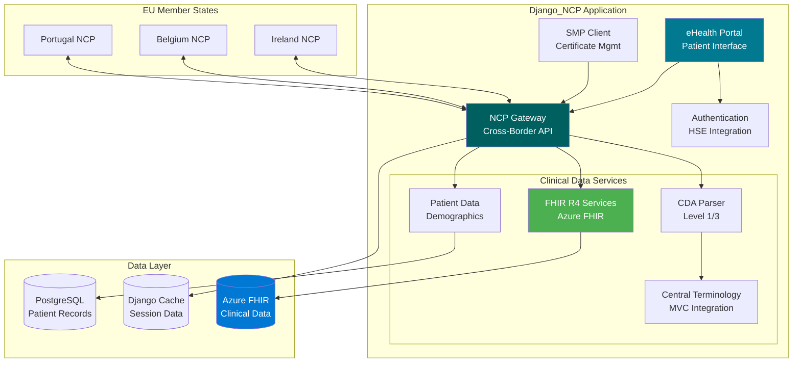
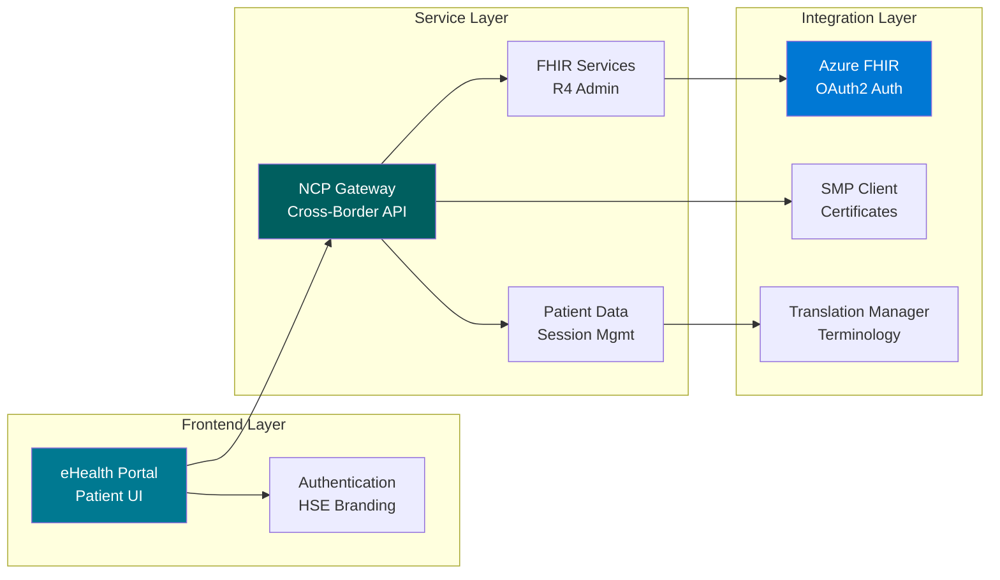
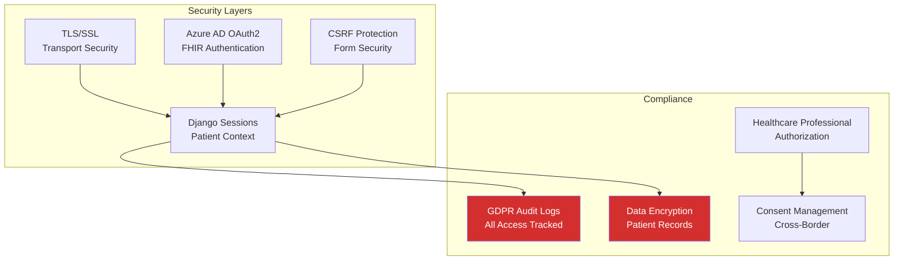
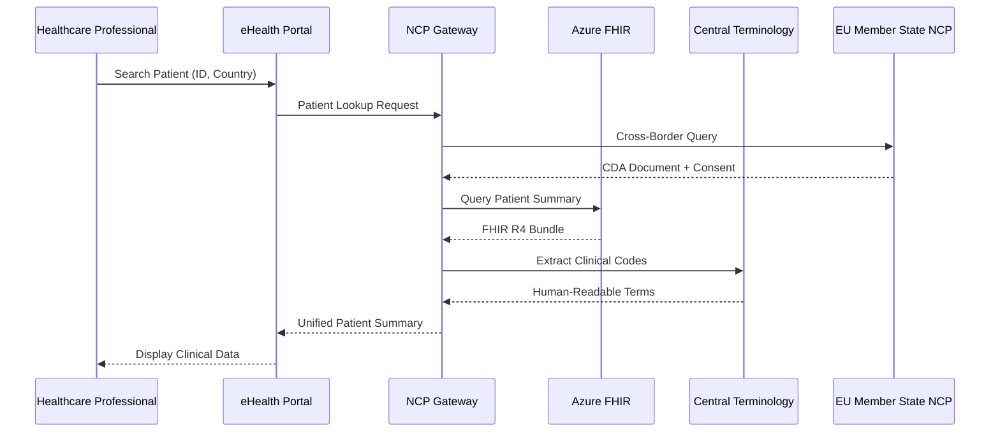

# Django_NCP - European eHealth National Contact Point

**Production-grade Django 5.2 application for EU cross-border healthcare data exchange**

[](https://www.python.org/downloads/)
[](https://www.djangoproject.com/)
[](https://www.hl7.org/fhir/R4/)
[](LICENSE)

European healthcare interoperability platform implementing epSOS/eHDSI standards for Patient Summary, ePrescription, eDispensation, and cross-border clinical data exchange.

---

## 🏥 System Architecture



## 🎯 Core Capabilities

### Healthcare Data Exchange
- **Patient Summary (PS)** - IPS-compliant cross-border patient summaries
- **ePrescription (eP)** - Electronic prescription exchange across EU
- **eDispensation (eD)** - Pharmacy dispensation records
- **Laboratory Results** - Clinical lab data integration
- **Hospital Discharge** - Care continuity documentation
- **Medical Imaging** - Radiology report exchange

### Clinical Document Processing
- **CDA R2** - Level 1 (PDF) and Level 3 (structured) parsing
- **FHIR R4** - Azure Healthcare APIs integration
- **Terminology** - Master Value Catalogue for code translation
- **Multi-language** - English/Irish clinical terminology support

## 🚀 Quick Start

### Prerequisites
- Python 3.12+
- PostgreSQL 13+ (production) or SQLite (development)
- Azure FHIR Service (optional)
- Node.js/npm (for SASS compilation)

### Installation

```bash
# Clone repository
git clone https://github.com/ddeveloper72/Django_NCP.git
cd Django_NCP

# Create virtual environment
python -m venv .venv
.venv\Scripts\activate  # Windows
source .venv/bin/activate  # Linux/Mac

# Install dependencies
pip install -r requirements.txt

# Environment setup
cp .env.example .env
# Edit .env with your configuration

# Database migration
python manage.py migrate

# Create admin user
python manage.py createsuperuser

# Compile SCSS
sass static/scss:static/css

# Run development server
python manage.py runserver
```

Visit `http://127.0.0.1:8000` for the eHealth Portal.

---

## 📦 Application Modules



### Module Overview

| Module | Purpose | Key Features |
|--------|---------|--------------|
| `ehealth_portal/` | Patient portal UI | Patient search, document display, session management |
| `ncp_gateway/` | Cross-border API | Country models, patient lookup, NCP-to-NCP communication |
| `patient_data/` | Clinical data | Demographics, CDA parsing, FHIR integration |
| `fhir_services/` | FHIR R4 admin | PS/eP/eD management, Azure FHIR connectivity |
| `authentication/` | User security | HSE-themed login, RBAC, healthcare professional auth |
| `smp_client/` | SMP integration | Certificate validation, service metadata |
| `translation_manager/` | Terminology | MVC integration, code system management |

## 🔐 Security & Compliance



### Key Security Features
- **Transport Security**: TLS 1.2+ for all communications
- **Authentication**: Azure AD integration, healthcare professional credentials
- **Session Management**: Encrypted patient sessions with automatic cleanup
- **Audit Trail**: GDPR-compliant logging of all clinical data access
- **Data Protection**: Encrypted storage, consent-based cross-border exchange
- **Certificate Management**: X.509 certificate validation for SMP integration

---

## 📚 Documentation

### Developer Guides
- [Architecture Overview](.github/copilot-instructions.md) - System design and patterns
- [FHIR Integration](AZURE_FHIR_SETUP.md) - Azure Healthcare APIs setup
- [CDA Processing](CDA_DOCUMENT_INDEX_README.md) - Clinical document parsing
- [SCSS Standards](.specs/scss-standards-index.md) - Frontend styling guidelines
- [Testing Standards](.specs/testing-and-modular-code-standards.md) - Unit test requirements

### Operational Guides
- [Heroku Deployment](HEROKU_DEPLOYMENT.md) - Production deployment
- [Cache Management](CACHE_CLEAR_INSTRUCTIONS.md) - Session cleanup
- [Security Setup](SECURITY_QUICKSTART.md) - Security configuration

### Healthcare Standards
- [epSOS/eHDSI](https://www.ehealthireland.ie/technology-and-transformation-functions/standards-and-shared-care-records-sscr/myhealth-eu/) - MyHealth@EU standards
- [FHIR R4](https://www.hl7.org/fhir/R4/) - HL7 FHIR specification
- [CDA R2](https://www.hl7.org/implement/standards/product_brief.cfm?product_id=7) - Clinical Document Architecture

---

## 🛠️ Development

### Project Structure
```
django_ncp/
├── eu_ncp_server/          # Django configuration, settings, middleware
├── ehealth_portal/         # Patient portal views and templates
├── ncp_gateway/            # Cross-border API, country models
├── patient_data/           # Clinical data services, CDA/FHIR parsing
├── fhir_services/          # FHIR R4 admin interfaces
├── authentication/         # HSE-themed authentication
├── smp_client/             # Certificate and SMP integration
├── translation_manager/    # Terminology and MVC management
├── static/                 # SCSS, CSS, JavaScript, images
├── templates/              # Django HTML templates
├── tests/                  # Unit and integration tests
└── docs/                   # Technical documentation
```

### Testing
```bash
# Run all tests
pytest

# Run specific test module
pytest tests/patient_data/

# Run with coverage
pytest --cov=patient_data
```

### SCSS Compilation
```bash
# Watch mode (auto-compile)
sass --watch static/scss:static/css

# One-time compilation
sass static/scss:static/css

# Production build
sass static/scss:static/css --style=compressed
```

## 🔄 Clinical Data Flow



---

## 🌍 EU Member State Integration

| Country | Status | OID | Supported Services |
|---------|--------|-----|-------------------|
| 🇮🇪 Ireland | ✅ Active | 2.16.372.1.100.1.1 | PS, eP, eD |
| 🇧🇪 Belgium | ✅ Active | 2.16.840.1.113883.1.1 | PS, eP |
| 🇵🇹 Portugal | ✅ Active | 2.16.620.1.101.10.1 | PS |
| 🇩🇪 Germany | 🔄 Planned | - | - |
| 🇫🇷 France | 🔄 Planned | - | - |

---

## 📊 Technology Stack

| Layer | Technology | Purpose |
|-------|-----------|---------|
| **Backend** | Django 5.2.7 | Web framework |
| **Database** | PostgreSQL 13+ | Patient data, sessions |
| **Cache** | Django Cache | Session management |
| **FHIR** | Azure Healthcare APIs | Clinical data storage |
| **Frontend** | SCSS (7-1 pattern) | Professional styling |
| **Authentication** | Django Auth + Azure AD | User and FHIR security |
| **Deployment** | Heroku + WhiteNoise | Production hosting |
| **Testing** | pytest | Unit and integration tests |

---

## 🤝 Contributing

We follow strict healthcare development standards:

1. **Service Layer Pattern** - Extract business logic to service classes
2. **Unit Testing** - Mandatory tests for all views and services
3. **SCSS Architecture** - No inline styles, use modular components
4. **No Hard-coded Clinical Data** - All terminology from Master Value Catalogue
5. **WCAG 2.2 Compliance** - Accessibility for healthcare professionals

See [Testing Standards](.specs/testing-and-modular-code-standards.md) for detailed guidelines.

---

## 📜 License & Compliance

This project implements EU eHealth specifications and follows:
- **GDPR** - General Data Protection Regulation
- **epSOS/eHDSI** - European Health Digital Services Infrastructure
- **FHIR R4** - HL7 Fast Healthcare Interoperability Resources
- **CDA R2** - Clinical Document Architecture

Healthcare data protection and patient privacy are paramount.

---

## 🔗 Related Projects

- [DomiSMP](https://github.com/ddeveloper72/IESMP) - Service Metadata Publisher (Java)
- [OpenNCP](https://github.com/openncp/openncp) - Reference NCP implementation (Java)
- [MyHealth@EU](https://www.ehealthireland.ie/technology-and-transformation-functions/standards-and-shared-care-records-sscr/myhealth-eu/) - Official EU eHealth portal

---

## 📞 Support

**Documentation**: `.github/` and `docs/` directories  
**Issues**: GitHub Issues  
**Healthcare Standards**: See documentation links above

---

**Built with ❤️ for European Healthcare Interoperability**
