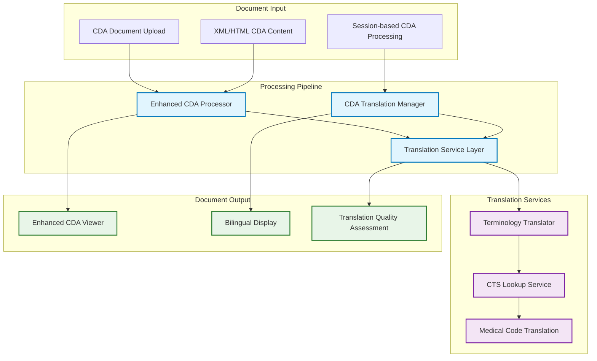
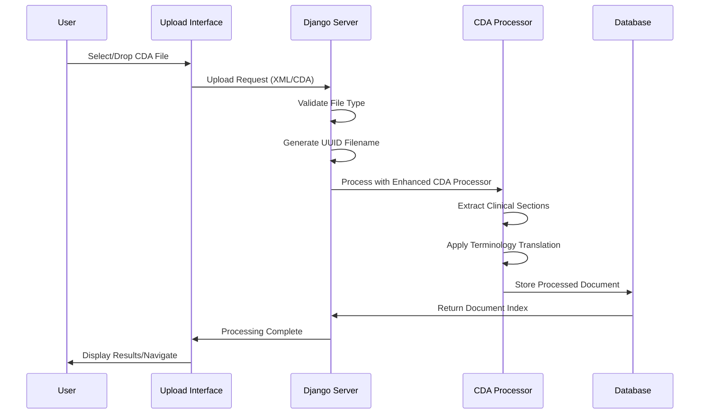

# CDA Processing Architecture

## Overview

This document consolidates all CDA (Clinical Document Architecture) processing components in the Django NCP system, providing a comprehensive guide to translation services, document processing pipelines, upload features, and terminology management. This architecture ensures proper handling of EU cross-border healthcare documents with medical credibility through Central Terminology Server (CTS) integration.

## System Architecture

### Information Flow



## Core Components

### 1. Enhanced CDA Processor

**Primary Service**: `patient_data/services/enhanced_cda_processor.py`

The Enhanced CDA Processor handles comprehensive clinical section processing with:

#### Key Capabilities

- CTS-compliant terminology service integration
- Country-specific CDA mapping (supports EU member states)
- Medical terminology translation through MVC model integration
- Clinical section extraction and processing
- Table rendering with PS Display Guidelines compliance

#### Service Architecture

```python
class EnhancedCDAProcessor:
    def __init__(self, target_language: str = "en", country_code: str = None):
        self.terminology_service = TerminologyTranslator(target_language)
        self.country_mapper = CountrySpecificCDAMapper()
        # Integration with Central Terminology Server models
        from translation_services.mvc_models import (
            ValueSetCatalogue, ValueSetConcept, ConceptTranslation
        )
```

#### Processing Workflow

1. **Document Analysis**: Extract clinical sections from CDA content
2. **Country Mapping**: Apply country-specific processing rules
3. **Terminology Translation**: Use CTS-based medical term translation
4. **Content Processing**: Generate structured clinical data with proper titles
5. **Quality Assessment**: Evaluate translation completeness and accuracy

### 2. CDA Translation Services

#### Enhanced CDA Translation Service

**Location**: `patient_data/services/enhanced_cda_translation_service.py`

Provides comprehensive document translation with section-by-section analysis:

```python
@dataclass
class CDASection:
    section_id: str
    title: str
    original_title: str
    content: str
    original_content: str
    narrative_text: str
    original_narrative: str
    codes: List[Dict]
    translated_codes: List[Dict]
    translation_status: str
```

#### Translation Manager

**Location**: `patient_data/services/cda_translation_manager.py`

Orchestrates the complete translation pipeline:

- **Enhanced Processor Integration**: Uses EnhancedCDAProcessor for comprehensive clinical sections
- **XML Parser Integration**: Handles raw XML CDA content with medical coding
- **Quality Assessment**: Provides translation quality metrics and reporting
- **Multi-format Support**: Processes both XML and HTML CDA formats

### 3. Terminology Translation Architecture

#### Central Terminology Server Integration

The system eliminates hardcoded language translations in favor of medical credibility through CTS:

**Before (Hardcoded - DEPRECATED)**:

```python
class MedicalTerminologyTranslator:  # REMOVED
    def __init__(self):
        self.fr_to_en = {
            "Allergie": "Allergy",
            "Heure": "Time",  # Hardcoded French - violated no-hardcode requirement
        }
```

**After (CTS-Based - CURRENT)**:

```python
class TerminologyTranslator:
    def translate_clinical_document(self, document_content: str, source_language: str):
        # Extract terminology codes from document
        extracted_terms = self._extract_terminology_codes(document_content)
        # Translate using Central Terminology Server
        for term in extracted_terms:
            translation = self._translate_term(
                code=term["code"],
                system=term["system"],
                original_display=term.get("display")
            )
```

#### Compatibility Bridge

**Component**: `TerminologyTranslatorCompat`

- Maintains legacy method calls during architectural transition
- Provides smooth migration path from hardcoded to CTS-based translation
- Supports existing CDA translation workflows without disruption

### 4. Document Upload and Processing

#### Upload Feature Architecture

**Implementation**: Comprehensive CDA document upload system with:

- **Secure File Storage**: UUID-based filename generation in `media/uploads/cda_documents/`
- **Drag & Drop Interface**: Modern UI with visual feedback states
- **Real-time Processing**: Integration with Enhanced CDA Processor
- **Session Management**: Document tracking and status monitoring

#### Upload Process Flow



#### Document Management Interface

- **Status Tracking**: Processing status with visual indicators
- **Patient Information**: Extracted demographic and clinical data
- **Section Summaries**: Overview of clinical content with navigation
- **Batch Processing**: Support for multiple document handling

## Translation Quality Framework

### Quality Assessment Metrics

#### Translation Levels

- **Excellent (90%+)**: Comprehensive terminology coverage with clinical context preservation
- **Good (70-89%)**: Strong medical term translation with minor gaps
- **Fair (50-69%)**: Adequate coverage with some untranslated technical terms
- **Poor (<50%)**: Limited translation requiring manual review

#### Assessment Criteria

- **Section Translation Completeness**: Percentage of translated clinical sections
- **Terminology Translation Accuracy**: Medical code system coverage
- **Content Preservation**: Clinical context and meaning retention
- **Code System Coverage**: SNOMED CT, ICD-10, LOINC translation support

### Quality Indicators in UI

- **Color-coded Status Badges**: Visual quality representation
- **Section-level Scoring**: Individual clinical section assessment
- **Translation Summary Dashboard**: Overall document quality metrics
- **Terminology Tooltips**: Code system information and translation details

## User Interface Architecture

### Enhanced CDA Document Viewer

**Template**: `templates/jinja2/patient_data/enhanced_cda_document.html`

#### Viewing Modes

1. **Side-by-Side View**: Original and translated content simultaneously displayed
2. **Toggle View**: Switch between original and translated with section-level control
3. **Translated-Only View**: Clean interface with original accessible via tooltips

#### Interactive Features

- **Translation Control Panel**: Language selection and view mode toggles
- **Medical Terminology Tooltips**: Code system information display
- **Export Capabilities**: HTML and XML document export
- **Session Preferences**: User viewing mode persistence

### Styling Architecture Integration

The CDA viewer integrates with the consolidated CSS architecture:

- **Healthcare Color System**: Uses medical-grade color palette for clinical data
- **Component Patterns**: Follows established SCSS modular architecture
- **Responsive Design**: Mobile and desktop compatibility with accessibility support
- **Performance Optimization**: Efficient SASS compilation and static file management

## Service Integration Points

### Django Application Integration

#### URL Configuration

```python
# Enhanced CDA viewing
path("cda/enhanced/<int:patient_id>/", EnhancedCDADocumentView.as_view())
path("cda/translate-toggle/<int:patient_id>/", toggle_translation_view)
path("cda/section/<int:patient_id>/<str:section_id>/", get_section_translation)

# Document upload and management
path("upload-cda/", upload_cda_document)
path("uploaded-documents/", uploaded_documents_view)
path("process-document/<int:doc_index>/", process_uploaded_document)
```

#### View Architecture

- **Class-based Views**: `EnhancedCDADocumentView` for comprehensive document display
- **AJAX Integration**: Dynamic content loading and translation toggling
- **Session Management**: Document state persistence and user preferences
- **Authentication Integration**: Secure access with `@login_required` decorators

### Database Integration

#### Patient Data Models

Integration with existing patient data structure while maintaining CDA-specific information:

- **Document Storage**: Links to patient records with CDA-specific metadata
- **Translation History**: Version tracking and quality assessment storage
- **Session Data**: User preferences and document state management
- **Terminology Cache**: MVC model integration for performance optimization

## Performance and Security

### Performance Optimizations

- **Cache Cleanup**: Removed 1,028+ Python cache files for improved performance
- **SASS Compilation**: Optimized static file generation with watch mode
- **File Watcher Exclusions**: Reduced VS Code resource usage during development
- **Database Query Optimization**: Efficient terminology lookup and patient data retrieval

### Security Considerations

- **CSRF Protection**: All forms and AJAX requests properly protected
- **File Upload Validation**: Strict XML/CDA file type validation
- **User Authentication**: Required for all document access and processing
- **Medical Data Compliance**: GDPR-compliant handling of clinical information

## Development and Testing

### Testing with Sample Data

The system is ready for testing with Malta PS document:

- **Sample Document**: `test_data/Mario_Borg_9999002M_3.xml`
- **Processing Pipeline**: Full upload → process → view workflow
- **Translation Testing**: French clinical content to English with terminology validation

### Code Quality Standards

- **Type Annotations**: Comprehensive type hints throughout service layer
- **Error Handling**: Robust exception management with logging
- **Documentation**: Inline code documentation and architectural decision records
- **Logging**: Detailed operation tracking for debugging and monitoring

## Future Enhancement Roadmap

### Planned Technical Improvements

1. **Caching System**: Redis integration for terminology translation caching
2. **API Integration**: External translation service support for non-medical content
3. **Machine Learning**: Translation quality prediction and improvement algorithms
4. **Real-time Updates**: WebSocket-based translation status updates

### User Experience Enhancements

1. **PDF Export**: Enhanced document export with translation preservation
2. **Translation History**: Version comparison and change tracking
3. **User Feedback**: Translation quality improvement through user input
4. **Batch Processing**: Multiple document upload and processing capabilities

### Medical Compliance Features

1. **Audit Trail**: Complete translation and access logging
2. **Data Anonymization**: Privacy protection for clinical data
3. **Validation Rules**: Medical terminology consistency checking
4. **Certification**: Compliance with EU healthcare interoperability standards

---

## Summary

This consolidated CDA processing architecture provides:

- **Medical Credibility**: CTS-based terminology translation eliminates hardcoded languages
- **Comprehensive Processing**: Full pipeline from upload through display with quality assessment
- **User-Centered Design**: Multiple viewing modes with interactive translation controls
- **Performance Optimization**: Efficient processing with caching and optimization strategies
- **Regulatory Compliance**: GDPR-compliant medical data handling with audit capabilities
- **Extensible Framework**: Foundation for future enhancements and integration capabilities

The architecture successfully addresses the core requirement: "our python code should have no hardcode languages. not even English" through proper Central Terminology Server integration while providing a robust, scalable foundation for EU cross-border healthcare document processing.
