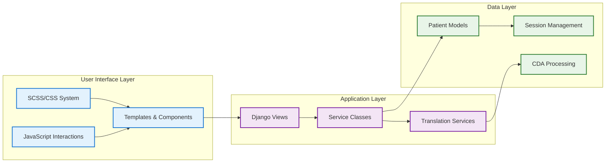

# Technical Architecture Library - Master Index

## Overview

This master index provides centralized navigation to all consolidated technical architecture documentation for the Django NCP system. This organized library shows process flows, information handling, and architectural patterns while integrating with our workload management system.

## Architecture Documentation Structure

### 🏗️ Core Technical Architecture

#### [Technical Architecture and Information Flow](./technical-architecture-and-information-flow.md)

**Primary Architecture Guide** - Comprehensive system overview with process flow diagrams

- **Scope**: Complete Django NCP system architecture from authentication through data display
- **Key Diagrams**: Patient data processing, authentication flows, session management, data transformation pipelines
- **Integration Points**: Templates, services, models, and static assets
- **Performance Patterns**: Caching, optimization strategies, and scalability considerations

#### [Consolidated CSS/SCSS Architecture](./consolidated-css-scss-architecture.md)

**Styling Architecture Guide** - Unified styling system with healthcare organization compliance

- **Scope**: Phase 6 consolidated CSS system with modular SCSS architecture
- **Key Patterns**: Healthcare color system, component patterns, responsive design
- **Compilation Pipeline**: SASS workflow, build processes, static file management
- **Integration**: References existing .specs documentation for development standards

#### [Consolidated CDA Processing Architecture](./consolidated-cda-processing-architecture.md)

**Medical Document Processing Guide** - Complete CDA translation and processing pipeline

- **Scope**: EU cross-border healthcare document processing with CTS integration
- **Key Services**: Enhanced CDA Processor, Translation Manager, Terminology Translator
- **Process Flow**: Document upload → processing → translation → quality assessment → display
- **Medical Compliance**: Central Terminology Server integration, GDPR compliance, audit trails

---

## Process Flow Reference

### Information Movement Patterns

The Django NCP system follows these key information flows:

1. **User Authentication & Session Management**
   - See: [Technical Architecture](./technical-architecture-and-information-flow.md#authentication-and-session-management)
   - Integration with CDA processing and patient data access

2. **Patient Data Processing Pipeline**
   - See: [Technical Architecture](./technical-architecture-and-information-flow.md#patient-data-processing)
   - Multi-stage processing with validation, transformation, and storage

3. **CDA Document Translation Workflow**
   - See: [CDA Processing](./consolidated-cda-processing-architecture.md#information-flow)
   - Medical terminology translation with quality assessment

4. **Styling and Frontend Architecture**
   - See: [CSS Architecture](./consolidated-css-scss-architecture.md#architectural-patterns)
   - Healthcare-compliant design system with component reusability

### Cross-System Integration Points

---

## Workload Management Integration

### Current System State

**Source**: [`.specs/retro-spec.md`](./.specs/retro-spec.md) - Current implementation status and compliance tracking

#### Implementation Compliance Status

- ✅ **Git workflow with incremental commits**: Small, focused commits implemented
- ✅ **Enhanced navigation accessibility**: WCAG-compliant navigation with ARIA labels
- ✅ **Healthcare colour palette**: Implemented in navigation and design system
- ⚠️ **Inline CSS removal**: Most templates cleaned, some blocks remain
- ⚠️ **Template simplification**: Logic moved to Python, some cleanup needed
- ❌ **Mock data replacement**: Some views still contain hardcoded data
- ❌ **Unit test coverage**: Limited automated testing implemented

### Active Development Tracking

Use the `manage_todo_list` tool to track architecture consolidation progress:

#### Current TODO Status (Consolidation Project)

- ✅ Analyze Existing Technical Architecture Documentation
- ✅ Create Technical Architecture Flow Documentation
- ✅ Consolidate CSS/SCSS Architecture Documentation
- ✅ Consolidate CDA Processing Architecture
- 🔄 Create Unified Technical Architecture Index *(current task)*
- ⏳ Clean Up Duplicate and Outdated Documentation

### Decision Log Integration

Key architectural decisions documented in retro-spec:

| Component | Decision | Architectural Impact |
|-----------|----------|---------------------|
| **Template Engine** | Django templates over Jinja2 | Native security, simpler integration |
| **Styling System** | SCSS with healthcare compliance | Modular, maintainable CSS architecture |
| **Translation Services** | CTS-based over hardcoded | Medical credibility, no language hardcoding |
| **CDA Processing** | Multi-service architecture | Scalable, testable medical document processing |

---

## Navigation and Usage Guide

### Quick Reference by Use Case

#### **For Developers Adding New Features**

1. Start with [Technical Architecture](./technical-architecture-and-information-flow.md) for system overview
2. Reference [CDA Processing](./consolidated-cda-processing-architecture.md) for medical document handling
3. Use [CSS Architecture](./consolidated-css-scss-architecture.md) for styling implementations
4. Check [retro-spec](./.specs/retro-spec.md) for current compliance requirements

#### **For System Maintenance**

1. Review [Technical Architecture](./technical-architecture-and-information-flow.md#performance-and-scalability) for optimization patterns
2. Check [CDA Processing](./consolidated-cda-processing-architecture.md#performance-and-security) for medical data handling
3. Reference [CSS Architecture](./consolidated-css-scss-architecture.md#performance-optimization) for frontend performance

#### **For Architecture Reviews**

1. [Technical Architecture](./technical-architecture-and-information-flow.md) - Complete system assessment
2. [CDA Processing](./consolidated-cda-processing-architecture.md) - Medical compliance review
3. [CSS Architecture](./consolidated-css-scss-architecture.md) - Frontend standards review
4. [retro-spec](./.specs/retro-spec.md) - Requirements compliance status

### Integration with Development Standards

The architecture documentation integrates with existing development standards:

- **`.specs/` Directory**: Development standards, code style, testing requirements
- **SCSS Architecture Standards**: Component patterns and naming conventions
- **Django Patterns**: Class-based views, service layer architecture, model design
- **Medical Compliance**: CTS integration, GDPR compliance, terminology management

---

## Maintenance and Updates

### Document Update Schedule

- **Technical Architecture**: Update with major system changes or new service integration
- **CDA Processing**: Update with medical terminology changes or compliance updates
- **CSS Architecture**: Update with design system evolution or healthcare guideline changes
- **Master Index**: Update when new architecture documents are added or structure changes

### Version Control Integration

All architecture documentation follows the established Git workflow:

- Small, focused commits for each document update
- Conventional commit messages for architecture changes
- Integration with TODO tracking for workload management
- Cross-references maintained during updates

### Quality Assurance

Architecture documentation quality maintained through:

- **Mermaid Diagrams**: Visual process flows for complex interactions
- **Cross-References**: Links between related architectural components
- **Implementation Examples**: Code snippets demonstrating patterns
- **Integration Testing**: Verification that documentation matches implementation

---

## Summary

This technical architecture library provides:

- **Comprehensive Coverage**: Complete system architecture from UI through data layer
- **Process Clarity**: Clear information flow diagrams and integration patterns
- **Workload Integration**: TODO tracking and retro-spec compliance monitoring
- **Practical Navigation**: Use-case based access to relevant documentation
- **Maintenance Framework**: Update procedures and quality assurance processes

The consolidated architecture supports the Django NCP system's core requirement: maintainable, scalable, medically-compliant cross-border healthcare data exchange without hardcoded languages or fragmented documentation.
